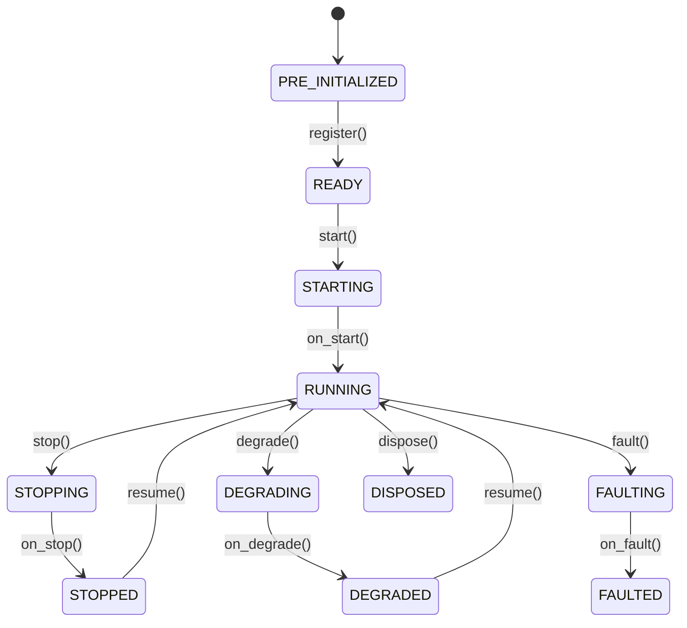

# Actors

> 本文档为 [English 原文](../../docs/concepts/actors.md) 的中文翻译版本。如有歧义请以英文原版为准。

`Actor` 接收数据、处理事件并管理状态。`Strategy` 类在 Actor 的基础上增加了订单管理能力。

**核心能力**：

- 数据订阅与请求（市场数据、自定义数据）。
- 事件处理与发布。
- 定时器与告警。
- 缓存与组合访问。
- 日志。

## 基本示例

Actor 支持通过与策略类似的模式进行配置。

```python
from nautilus_trader.config import ActorConfig
from nautilus_trader.model import InstrumentId
from nautilus_trader.model import Bar, BarType
from nautilus_trader.common.actor import Actor


class MyActorConfig(ActorConfig):
    instrument_id: InstrumentId   # 示例值："ETHUSDT-PERP.BINANCE"
    bar_type: BarType             # 示例值："ETHUSDT-PERP.BINANCE-15-MINUTE[LAST]-INTERNAL"
    lookback_period: int = 10


class MyActor(Actor):
    def __init__(self, config: MyActorConfig) -> None:
        super().__init__(config)

        # 自定义状态变量
        self.count_of_processed_bars: int = 0

    def on_start(self) -> None:
        # 订阅符合配置的 bar_type 的 K 线
        self.subscribe_bars(self.config.bar_type)

    def on_bar(self, bar: Bar) -> None:
        self.count_of_processed_bars += 1
```

## Actor 配置与 ID

Actor 可以接收一个 `ActorConfig` 子类。基础配置可以包含 `actor_id`；
若提供，actor 以该 ID 注册。若省略，系统派生一个运行时 actor ID。

将配置视为 actor 的构造数据。通过 `self.config` 读取用户提供的设置，
而将运行时状态保留在 actor 自身上。

:::info Rust 实现
对于 Rust actor，生成或分配的运行时 ID 保存在 actor 核心上，而不是回写到 `DataActorConfig` 中。
这与 Python 桥接路径不同——后者在从可导入配置创建 Python 对象时，可能会将继承的配置字段复制到运行时状态。
:::

## 生命周期

Actor 在其生命周期中遵循一个明确的状态机：



重写以下方法以钩入生命周期事件：

| 方法             | 调用时机                                                            |
|------------------|---------------------------------------------------------------------|
| `on_start()`     | Actor 正在启动（在这里订阅数据）。                                  |
| `on_stop()`      | Actor 正在停止（取消定时器、清理资源）。                            |
| `on_resume()`    | Actor 从停止状态恢复。                                              |
| `on_reset()`     | 重置指标和内部状态（在多次回测之间调用）。                          |
| `on_degrade()`   | Actor 进入降级状态（部分功能可用）。                                |
| `on_fault()`     | Actor 遇到故障。                                                    |
| `on_dispose()`   | Actor 正在销毁（最终清理）。                                        |

## 定时器与告警

Actor 可访问时钟用于调度：

```python
def on_start(self) -> None:
    # 设置一个带回调的循环定时器（每 5 秒触发）
    self.clock.set_timer(
        "my_timer",
        timedelta(seconds=5),
        callback=self._on_timer,
    )

    # 设置一个带回调的一次性告警
    self.clock.set_time_alert(
        "my_alert",
        self.clock.utc_now() + timedelta(minutes=1),
        callback=self._on_alert,
    )

def on_stop(self) -> None:
    # 取消定时器以防止跨停止/恢复周期的资源泄漏
    self.clock.cancel_timer("my_timer")

def _on_timer(self, event: TimeEvent) -> None:
    self.log.info("Timer fired!")

def _on_alert(self, event: TimeEvent) -> None:
    self.log.info("Alert triggered!")
```

传入 `callback` 可将 `TimeEvent` 对象直接派发到你自己的方法。
若省略 callback，事件会被派发到 `on_event`。

## 系统访问

Actor 可访问核心系统组件：

| 属性              | 描述                                                     |
|-------------------|----------------------------------------------------------|
| `self.cache`      | instrument、订单、持仓等的共享状态。                     |
| `self.portfolio`  | 组合状态与计算。                                         |
| `self.clock`      | 当前时间以及定时器/告警调度。                            |
| `self.log`        | 结构化日志。                                             |
| `self.msgbus`     | 自定义消息的发布/订阅。                                  |

组件间自定义消息请参见 [Message Bus](message_bus.md) 指南。

## 数据处理与回调

系统根据数据是历史的还是实时的使用不同的回调处理器。
理解数据*请求/订阅*与其处理器的关系非常关键。

### 历史 vs 实时数据

系统区分两种数据流：

1. **历史数据**（来自*请求*）：
   - 通过 `request_bars()`、`request_quote_ticks()` 等方法获取。
   - 通过 `on_historical_data()` 处理器处理。
   - 用于初始数据加载和历史分析。

2. **实时数据**（来自*订阅*）：
   - 通过 `subscribe_bars()`、`subscribe_quote_ticks()` 等方法获取。
   - 通过特定处理器如 `on_bar()`、`on_quote_tick()` 处理。
   - 用于实时数据处理。

### 回调处理器

不同的数据操作映射到这些处理器：

| 操作                                  | 类别       | 处理器                    | 用途                                              |
|--------------------------------------|------------|--------------------------|---------------------------------------------------|
| `subscribe_data()`                   | 实时       | `on_data()`              | 实时数据更新。                                    |
| `subscribe_instrument()`             | 实时       | `on_instrument()`        | 实时 instrument 定义更新。                        |
| `subscribe_instruments()`            | 实时       | `on_instrument()`        | 实时 instrument 定义更新（按 venue）。            |
| `subscribe_order_book_deltas()`      | 实时       | `on_order_book_deltas()` | 实时订单簿增量。                                  |
| `subscribe_order_book_depth()`       | 实时       | `on_order_book_depth()`  | 实时订单簿深度快照。                              |
| `subscribe_order_book_at_interval()` | 实时       | `on_order_book()`        | 按间隔的实时订单簿快照。                          |
| `subscribe_quote_ticks()`            | 实时       | `on_quote_tick()`        | 实时报价更新。                                    |
| `subscribe_trade_ticks()`            | 实时       | `on_trade_tick()`        | 实时成交更新。                                    |
| `subscribe_mark_prices()`            | 实时       | `on_mark_price()`        | 实时 mark 价格更新。                              |
| `subscribe_index_prices()`           | 实时       | `on_index_price()`       | 实时指数价格更新。                                |
| `subscribe_bars()`                   | 实时       | `on_bar()`               | 实时 K 线更新。                                   |
| `subscribe_funding_rates()`          | 实时       | `on_funding_rate()`      | 实时资金费率更新。                                |
| `subscribe_instrument_status()`      | 实时       | `on_instrument_status()` | 实时 instrument 状态更新。                        |
| `subscribe_instrument_close()`       | 实时       | `on_instrument_close()`  | 实时 instrument 收盘更新。                        |
| `subscribe_option_greeks()`          | 实时       | `on_option_greeks()`     | 实时期权 Greeks 更新。                            |
| `subscribe_option_chain()`           | 实时       | `on_option_chain()`      | 实时期权链切片快照。                              |
| `subscribe_order_fills()`            | 实时       | `on_order_filled()`      | 某 instrument 的实时订单成交事件。                |
| `subscribe_order_cancels()`          | 实时       | `on_order_canceled()`    | 某 instrument 的实时订单撤销事件。                |
| `request_data()`                     | 历史       | `on_historical_data()`   | 历史数据处理。                                    |
| `request_order_book_deltas()`        | 历史       | `on_historical_data()`   | 历史订单簿增量。                                  |
| `request_order_book_depth()`         | 历史       | `on_historical_data()`   | 历史订单簿深度。                                  |
| `request_order_book_snapshot()`      | 历史       | `on_historical_data()`   | 历史订单簿快照。                                  |
| `request_instrument()`               | 历史       | `on_instrument()`        | Instrument 定义。                                 |
| `request_instruments()`              | 历史       | `on_instrument()`        | Instrument 定义。                                 |
| `request_quote_ticks()`              | 历史       | `on_historical_data()`   | 历史报价处理。                                    |
| `request_trade_ticks()`              | 历史       | `on_historical_data()`   | 历史成交处理。                                    |
| `request_bars()`                     | 历史       | `on_historical_data()`   | 历史 K 线处理。                                   |
| `request_aggregated_bars()`          | 历史       | `on_historical_data()`   | 即席聚合的历史 K 线。                             |
| `request_funding_rates()`            | 历史       | `on_historical_data()`   | 历史资金费率处理。                                |

### 示例

下面的示例同时演示了历史数据与实时数据处理：

```python
from nautilus_trader.common.actor import Actor
from nautilus_trader.config import ActorConfig
from nautilus_trader.core.data import Data
from nautilus_trader.model import Bar, BarType
from nautilus_trader.model import ClientId, InstrumentId


class MyActorConfig(ActorConfig):
    instrument_id: InstrumentId  # 示例值："AAPL.XNAS"
    bar_type: BarType            # 示例值："AAPL.XNAS-1-MINUTE-LAST-EXTERNAL"


class MyActor(Actor):
    def __init__(self, config: MyActorConfig) -> None:
        super().__init__(config)
        self.bar_type = config.bar_type

    def on_start(self) -> None:
        # 请求历史数据 —— 由 on_historical_data() 处理器处理
        self.request_bars(
            bar_type=self.bar_type,
            # 大量可选参数
            start=None,                # pd.Timestamp | None
            end=None,                  # pd.Timestamp | None
            callback=None,             # Callable[[UUID4], None] | None
            update_catalog_mode=None,  # UpdateCatalogMode | None
            params=None,               # dict[str, Any] | None
        )

        # 订阅实时数据 —— 由 on_bar() 处理器处理
        self.subscribe_bars(
            bar_type=self.bar_type,
            # 大量可选参数
            client_id=None,  # ClientId，可选
            params=None,     # dict[str, Any]，可选
        )

    def on_historical_data(self, data: Data) -> None:
        # 处理历史数据（来自请求）
        if isinstance(data, Bar):
            self.log.info(f"Received historical bar: {data}")

    def on_bar(self, bar: Bar) -> None:
        # 处理实时 K 线更新（来自订阅）
        self.log.info(f"Received real-time bar: {bar}")
```

将历史与实时处理器分开，使你可以根据上下文应用不同的处理逻辑。例如：

- 使用历史数据初始化指标或建立基线指标。
- 用不同方式处理实时数据以作出实盘交易决策。
- 对历史数据与实时数据应用不同的校验或日志策略。

:::tip
在调试数据流问题时，请检查你是否查看了与数据来源对应的处理器。
如果你在 `on_bar()` 中看不到数据但日志显示收到了 K 线，请检查 `on_historical_data()` ——
数据可能来自请求而非订阅。
:::

## 订单成交订阅

Actor 可以使用 `subscribe_order_fills()` 订阅指定 instrument 的订单成交事件。
这对监控交易活动、成交分析或跟踪执行质量非常有用。

订阅后，`on_order_filled()` 处理器会接收该 instrument 的所有成交，
无论原始订单由哪个策略或组件生成。

### 示例

```python
from nautilus_trader.common.actor import Actor
from nautilus_trader.config import ActorConfig
from nautilus_trader.model import InstrumentId
from nautilus_trader.model.events import OrderFilled


class MyActorConfig(ActorConfig):
    instrument_id: InstrumentId  # 示例值："ETHUSDT-PERP.BINANCE"


class FillMonitorActor(Actor):
    def __init__(self, config: MyActorConfig) -> None:
        super().__init__(config)
        self.fill_count = 0
        self.total_volume = 0.0

    def on_start(self) -> None:
        # 订阅该 instrument 的所有成交
        self.subscribe_order_fills(self.config.instrument_id)

    def on_order_filled(self, event: OrderFilled) -> None:
        # 处理订单成交事件
        self.fill_count += 1
        self.total_volume += float(event.last_qty)

        self.log.info(
            f"Fill received: {event.order_side} {event.last_qty} @ {event.last_px}, "
            f"Total fills: {self.fill_count}, Volume: {self.total_volume}"
        )

    def on_stop(self) -> None:
        # 取消订阅
        self.unsubscribe_order_fills(self.config.instrument_id)
```

:::note
订单成交订阅仅使用消息总线，不涉及数据引擎。
`on_order_filled()` 处理器仅在 actor 运行期间接收事件。
:::

## 订单撤销订阅

Actor 可以使用 `subscribe_order_cancels()` 订阅指定 instrument 的订单撤销事件。
这对监控撤单或跟踪订单生命周期事件非常有用。

订阅后，`on_order_canceled()` 处理器会接收该 instrument 的所有撤销事件，
无论原始订单由哪个策略或组件生成。

### 示例

```python
from nautilus_trader.common.actor import Actor
from nautilus_trader.config import ActorConfig
from nautilus_trader.model import InstrumentId
from nautilus_trader.model.events import OrderCanceled


class MyActorConfig(ActorConfig):
    instrument_id: InstrumentId  # 示例值："ETHUSDT-PERP.BINANCE"


class CancelMonitorActor(Actor):
    def __init__(self, config: MyActorConfig) -> None:
        super().__init__(config)
        self.cancel_count = 0

    def on_start(self) -> None:
        # 订阅该 instrument 的所有撤销事件
        self.subscribe_order_cancels(self.config.instrument_id)

    def on_order_canceled(self, event: OrderCanceled) -> None:
        # 处理订单撤销事件
        self.cancel_count += 1

        self.log.info(
            f"Cancel received: {event.client_order_id}, "
            f"Total cancels: {self.cancel_count}"
        )

    def on_stop(self) -> None:
        # 取消订阅
        self.unsubscribe_order_cancels(self.config.instrument_id)
```

:::note
订单撤销订阅仅使用消息总线，不涉及数据引擎。
`on_order_canceled()` 处理器仅在 actor 运行期间接收事件。
:::

## 相关指南

- [Strategies](strategies.md) - 策略在 actor 基础上增加订单管理能力。
- [Data](data.md) - actor 可用的数据类型与订阅。
- [Message Bus](message_bus.md) - actor 用于通信的消息系统。
