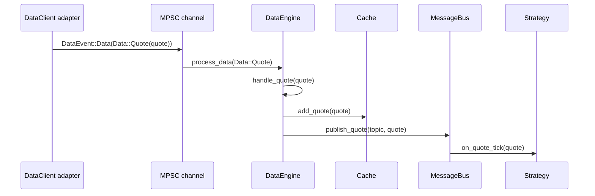
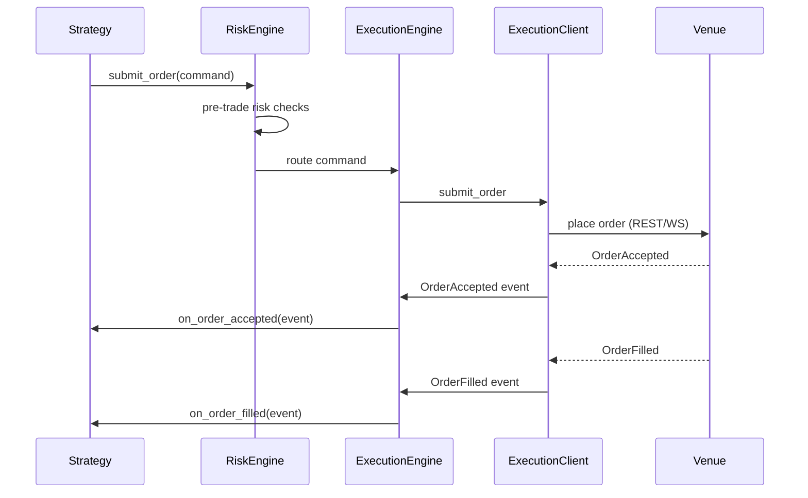
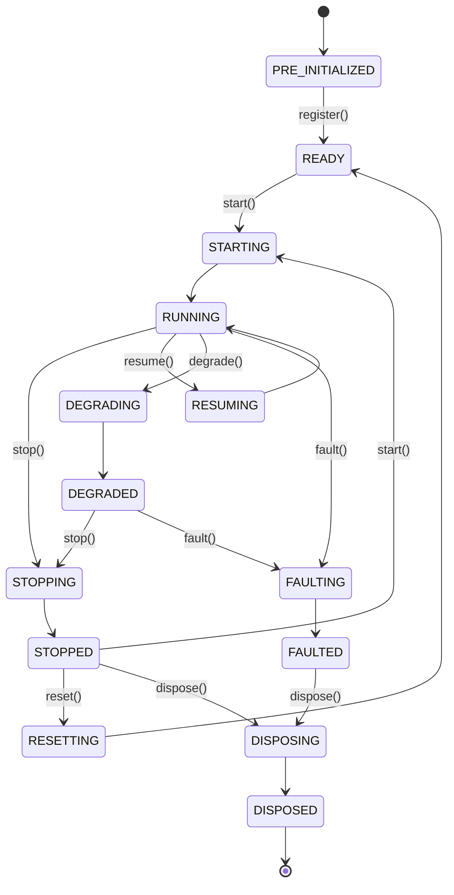
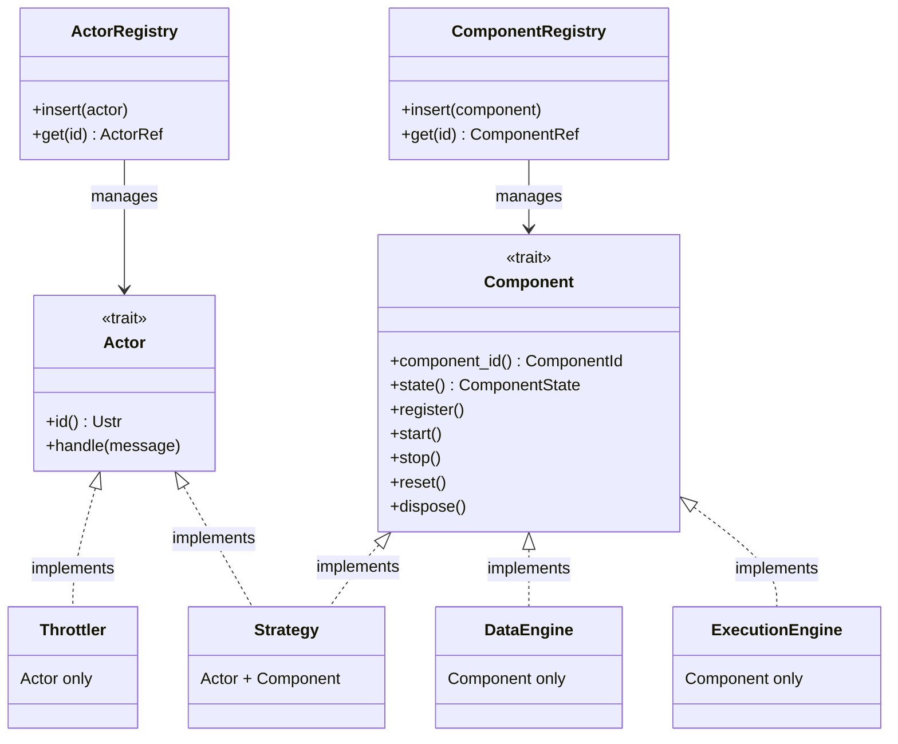
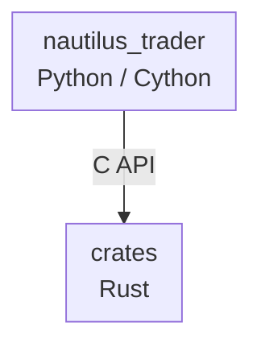
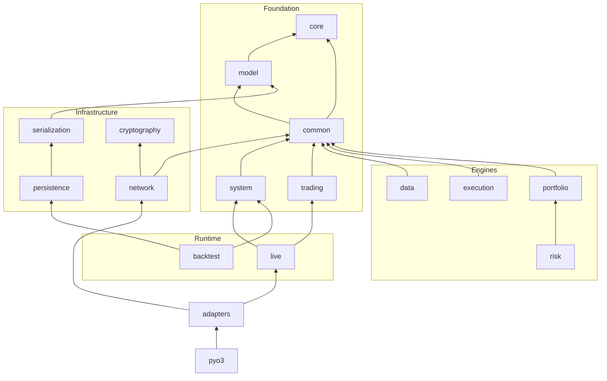

# 架构

> 本文档为 [English 原文](../../docs/concepts/architecture.md) 的中文翻译版本。如有歧义请以英文原版为准。

本指南介绍 NautilusTrader 的架构原则与结构：

- 设计哲学与质量属性。
- 核心组件及其相互交互。
- 环境上下文（backtest、sandbox、live）。
- 框架组织与代码结构。

:::note
在整个文档中，术语*"Nautilus 系统边界"*指的是单个 Nautilus 节点（也称为"trader 实例"）运行时内的操作。
:::

## 设计哲学

NautilusTrader 采用的主要架构技术与设计模式包括：

- [领域驱动设计（DDD）](https://en.wikipedia.org/wiki/Domain-driven_design)
- [事件驱动架构](https://en.wikipedia.org/wiki/Event-driven_programming)
- [消息模式](https://en.wikipedia.org/wiki/Messaging_pattern)（发布/订阅、请求/响应、点对点）
- [端口与适配器](https://en.wikipedia.org/wiki/Hexagonal_architecture_(software))
- [Crash-only 设计](#crash-only-design)

这些技术有助于实现某些架构质量属性。

### 质量属性

架构决策通常是相互竞争的优先级之间的权衡。以下质量属性指导设计与架构决策，大致按权重排序：

- 可靠性
- 性能
- 模块化
- 可测试性
- 可维护性
- 可部署性

### 以保障为驱动的工程实践

NautilusTrader 正在逐步采用一种高保障思维方式：关键代码路径应携带可执行的不变式，用以校验行为是否符合业务需求。具体而言，我们：

- 识别故障爆炸半径最大的组件（核心领域类型、风险与执行流程），并用自然语言写下它们的不变式。
- 将这些不变式编码为可执行检查（单元测试、属性测试、模糊测试、静态断言），在 CI 中运行，保持反馈循环的轻量化。
- 优先采用 Rust 内置的零成本安全技术（所有权、`Result` 表面、`panic = abort`），并仅在物有所值的地方添加针对性的形式化工具。
- 将"保障债务"与功能工作一起跟踪，以便新的集成扩展安全网而不是绕过它。

这一方法既保持了平台的交付节奏，又为高风险流程提供了所需的额外审查。

延伸阅读：[High Assurance Rust](https://highassurance.rs/)。

### Crash-only 设计

NautilusTrader 借鉴了 [crash-only 设计](https://en.wikipedia.org/wiki/Crash-only_software)原则，特别是在处理不可恢复故障时。其核心洞见是：能够从崩溃干净恢复的系统，比那些拥有独立（且很少被测试）优雅关闭路径的系统更为健壮。

关键原则：

- **统一的恢复路径** - 启动与崩溃恢复共享同一条代码路径，确保其经过充分测试。
- **状态外置** - 关键状态在配置允许时持久化到外部，降低数据丢失风险；持久性取决于后端存储。
- **快速重启** - 系统设计为可在崩溃后快速重启，最小化停机时间。
- **幂等操作** - 操作被设计为可在重启后安全重试。
- **不可恢复错误时快速失败** - 数据损坏或不变式违反会触发立即终止，而不是尝试在受损状态下继续。

:::note
系统确实提供了正常操作的优雅关闭流程（`stop`、`dispose`）。这些流程会拆除客户端、持久化状态并刷写写入器。crash-only 哲学专门适用于*不可恢复故障*，在这些故障中尝试优雅清理可能会造成进一步损害。
:::

此设计与[快速失败策略](#data-integrity-and-fail-fast-policy)互为补充，后者使不可恢复错误导致进程立即终止。

**参考资料：**

- [Crash-Only Software](https://www.usenix.org/conference/hotos-ix/crash-only-software) - Candea & Fox，HotOS 2003（原始研究论文）
- [Microreboot: A technique for cheap recovery](https://www.usenix.org/events/osdi04/tech/candea.html) - Candea 等人，OSDI 2004
- [The properties of crash-only software](https://brooker.co.za/blog/2012/01/22/crash-only.html) - Marc Brooker 的博客
- [Crash-only software: More than meets the eye](https://lwn.net/Articles/191059/) - LWN.net 文章
- [Recovery-Oriented Computing (ROC) Project](http://roc.cs.berkeley.edu/) - 加州大学伯克利分校/斯坦福研究项目

### 数据完整性与快速失败策略

NautilusTrader 在交易操作中优先保证数据完整性而非可用性。系统在算术运算与数据处理中采用严格的快速失败策略，以防止可能导致错误交易决策的静默数据损坏。

#### 快速失败原则

系统在遇到以下情况时会快速失败（panic 或返回错误）：

- 在时间戳、价格或数量上的算术溢出或下溢，超出有效范围。
- 反序列化期间的无效数据，包括行情数据或配置中的 NaN、Infinity 或超出范围的值。
- 类型转换失败，例如在只允许正值的位置出现负值（时间戳、数量）。
- 价格、时间戳或精度值的格式错误解析。

理由：

在交易系统中，损坏的数据比没有数据更糟糕。单个错误的价格、时间戳或数量可能在系统中级联传播，导致：

- 错误的仓位规模或风险计算。
- 在错误价格上下达订单。
- 回测产生误导性结果。
- 隐性的财务损失。

通过在无效数据上立即崩溃，NautilusTrader 旨在提供：

1. **无静默损坏** - 快速失败策略旨在防止无效数据扩散；这依赖于覆盖输入的检查。
2. **即时反馈** - 在开发与测试期间发现问题，而不是在生产环境中。
3. **审计轨迹** - 崩溃日志清晰地标识无效数据的来源。
4. **确定性行为** - 在确定性排序与配置下，相同的无效输入应触发相同的失败；非确定性来源可能产生不同结果。

#### 何时适用快速失败

panic 用于：

- 程序员错误（逻辑 bug、错误的 API 用法）。
- 违反基本不变式的数据（负时间戳、NaN 价格）。
- 会静默产生错误结果的算术运算。

Result 或 Option 用于：

- 预期的运行时失败（网络错误、文件 I/O）。
- 业务逻辑校验（订单约束、风险限制）。
- 用户输入校验。
- 暴露给下游 crate 的库 API，调用方需要显式错误处理而不依赖 panic 来控制流程。

#### 示例场景

```rust
// CORRECT: Panics on overflow - prevents data corruption
let total_ns = timestamp1 + timestamp2; // Panics if result > u64::MAX

// CORRECT: Rejects NaN during deserialization
let price = serde_json::from_str("NaN"); // Error: "must be finite"

// CORRECT: Explicit overflow handling when needed
let total_ns = timestamp1.checked_add(timestamp2)?; // Returns Option<UnixNanos>
```

此策略贯穿核心类型（`UnixNanos`、`Price`、`Quantity` 等），并帮助 NautilusTrader 为生产交易维持强健的数据正确性。

在生产部署中，系统通常在 release 构建中配置 `panic = abort`，确保任何 panic 都会导致干净的进程终止，可由进程监管者或编排系统处理。这与 [crash-only 设计](#crash-only-design)原则保持一致：不可恢复错误导致立即重启，而不是尝试在可能损坏的状态下继续。

## 系统架构

NautilusTrader 代码库实际上既是一个用于组合交易系统的框架，也是一组可在不同[环境上下文](#environment-contexts)下运行的默认系统实现。


### 核心组件

几个核心组件协同工作以构成交易系统：

#### `NautilusKernel`

中央编排组件，职责包括：

- 初始化与管理所有系统组件。
- 配置消息基础设施。
- 维护环境特定的行为。
- 协调共享资源与生命周期管理。
- 为系统操作提供统一的入口点。

#### `MessageBus`

组件间通信的骨干，实现：

- **发布/订阅模式**：用于向多个消费者广播事件与数据。
- **请求/响应通信**：用于需要确认的操作。
- **命令/事件消息**：用于触发动作与通知状态变更。
- **可选的状态持久化**：使用 Redis 实现持久性与重启能力。

#### `Cache`

高性能的内存存储系统：

- 存储标的、账户、订单、持仓等。
- 为交易组件提供高性能的获取能力。
- 在整个系统中维护一致的状态。
- 支持读取与写入操作，并优化了访问模式。

#### `DataEngine`

在整个系统中处理与路由行情数据：

- 处理多种数据类型（报价、成交、K 线、订单簿、自定义数据等）。
- 根据订阅将数据路由到合适的消费者。
- 管理从外部数据源到内部组件的数据流。

#### `ExecutionEngine`

管理订单生命周期与执行：

- 将交易命令路由到合适的适配器客户端。
- 跟踪订单与持仓状态。
- 与风险管理系统协调。
- 处理来自交易所的执行报告与成交。
- 处理外部执行状态的对账。

#### `RiskEngine`

提供风险管理：

- 交易前的风险检查与校验。
- 持仓与暴露监控。
- 实时风险计算。
- 可配置的风控规则与限制。

### 环境上下文

NautilusTrader 中的环境上下文定义了你所使用的数据与交易所类型。理解这些上下文对回测、开发和实盘交易都很重要。

以下是你可以使用的环境：

- `Backtest`：历史数据 + 模拟交易所。
- `Sandbox`：实时数据 + 模拟交易所。
- `Live`：实时数据 + 真实交易所（模拟交易或真实账户）。

### 公共内核

平台被设计为尽可能多地在回测、沙盒与实盘交易系统之间共享公共代码。这一点在 `system` 子包中正式化，你可以在其中找到 `NautilusKernel` 类，它提供了一个公共的系统"内核"。

*端口与适配器*架构风格使模块化组件能够集成到核心系统中，提供各种钩子用于用户定义或自定义的组件实现。

### 数据流与执行流模式

理解数据与执行如何流经系统，有助于你在使用平台时更加得心应手。

#### 数据流：一个 quote tick 的生命周期

下面的追踪展示了 `QuoteTick` 从网络到你的策略所经历的每一步。成交与 K 线遵循相同的"先缓存后发布"路径，只是处理器名称不同。订单簿增量（delta）和深度快照走的是另一条路径（见步骤下方的提示）。



**逐步说明：**

1. **适配器接收原始数据。** 交易所特定的 `DataClient`（例如 Binance、Bybit）接收 WebSocket 消息，解析后构造一个 `QuoteTick`。
2. **适配器发送数据事件。** 适配器通过一个 MPSC 通道发送 `DataEvent::Data(Data::Quote(quote))`。在实盘模式下，这是一个异步无界通道；在回测中，引擎直接馈送数据。
3. **DataEngine 处理事件。** 通道接收方将事件路由到 `DataEngine::process_data`，后者分发到 `handle_quote`。
4. **Cache 存储 quote。** `handle_quote` 通过 `cache.add_quote(quote)` 将 quote 写入 `Cache`，使其可供任何组件通过 `self.cache.quote_tick(instrument_id)` 访问。
5. **MessageBus 发布。** 引擎在从 instrument ID 派生的主题（例如 `data.quotes.BINANCE.BTCUSDT-PERP`）上发布该 quote。`MessageBus` 找到所有订阅该主题的处理器。
6. **策略处理器触发。** 每个已订阅策略的 `on_quote_tick(quote)` 在单线程内核上运行。在处理器执行之前，quote 已经存在于缓存中，因此 `self.cache.quote_tick(instrument_id)` 返回相同的 quote。

:::tip
对于报价、成交与 K 线，"先缓存后发布"的顺序意味着你的策略处理器总能从缓存中读取最新值。订单簿增量与深度快照则是直接发布；订单簿状态通过 `BookUpdater` 订阅单独维护。
:::

#### 执行流：一个订单的生命周期

当策略提交订单时，它会流经校验、路由，然后作为执行事件流回：



1. **策略创建命令。** 策略调用 `self.submit_order(order)`。
2. **RiskEngine 校验。** 运行交易前检查（持仓限制、名义价值限制、订单频率）。如果检查失败，策略会收到 `OrderDenied`，订单永远不会到达交易所。
3. **ExecutionEngine 路由。** 命令被路由到目标交易所的 `ExecutionClient`。
4. **ExecutionClient 提交。** 适配器通过 REST 或 WebSocket 将订单发送到交易所。
5. **事件回流。** 交易所返回确认与成交。每个事件（Accepted、Filled、Canceled、Rejected、Expired）通过 `ExecutionEngine` 回流，后者在 `Cache` 中更新订单状态并将事件传递给策略的处理器。成交事件还会触发持仓与组合的更新。

#### 组件状态管理

所有组件都遵循有限状态机模式。`ComponentState` 枚举同时定义了稳定状态与过渡状态：



**稳定状态：**

- **PRE_INITIALIZED**：组件已实例化，但尚未准备好履行其规范。
- **READY**：组件已配置，可以启动。
- **RUNNING**：组件正常运行，可以履行其规范。
- **STOPPED**：组件已成功停止。
- **DEGRADED**：组件已降级，可能无法满足其完整规范。
- **FAULTED**：组件因检测到故障而关闭。
- **DISPOSED**：组件已关闭并释放所有资源。

**过渡状态：**

- **STARTING**：组件正在执行其 `start` 时的动作。
- **STOPPING**：组件正在执行其 `stop` 时的动作。
- **RESUMING**：组件在初次启动后再次启动。
- **RESETTING**：组件正在执行其 `reset` 时的动作。
- **DISPOSING**：组件正在执行其 `dispose` 时的动作。
- **DEGRADING**：组件正在执行其 `degrade` 时的动作。
- **FAULTING**：组件正在执行其 `fault` 时的动作。

过渡状态是状态转换期间发生的短暂中间状态。组件不应长时间停留在过渡状态。

#### Actor 与 Component trait 的区别

在 Rust 实现层，系统区分两个互补的 trait：



**`Actor` trait** - 消息分发：

- 提供 `handle` 方法，用于接收通过 actor 注册表分发的消息。
- 支持按 actor ID 进行类型安全的查找与消息分发。
- 由需要接收定向消息的组件使用（策略、限流器）。

**`Component` trait** - 生命周期管理：

- 管理状态转换（`start`、`stop`、`reset`、`dispose`）。
- 提供向系统内核的注册（`register`）。
- 通过上文描述的有限状态机跟踪组件状态。
- 由所有需要生命周期管理的系统组件使用。

:::note
所有组件都可以通过 `MessageBus` 直接发布与订阅消息——这与 `Actor` trait 无关。`Actor` trait 专门启用基于注册表的消息分发模式，其中消息通过 ID 被路由到特定 actor。
:::

这种分离允许：

- **仅 Actor**：无生命周期的轻量级消息处理器（例如 `Throttler`）。
- **仅 Component**：具有生命周期但使用直接 MessageBus 发布/订阅的系统基础设施（例如 `DataEngine`、`ExecutionEngine`）。
- **两个 trait 都实现**：既需要生命周期管理又需要定向消息分发的交易策略。

两个 trait 由各自的注册表管理以支持其不同的访问模式——生命周期方法是顺序调用的，而消息处理器在回调期间可能会被重入调用。

### 消息传递

为了实现模块化与松耦合，高效的 `MessageBus` 在组件之间传递消息（数据、命令与事件）。

#### 线程模型

在节点内部，*kernel* 在单线程上消费与分发消息。kernel 包含：

- `MessageBus` 与 actor 回调分发。
- 策略逻辑与订单管理。
- 风控引擎检查与执行协调。
- Cache 的读取与写入。

这个单线程核心提供了确定性的事件排序，并有助于维持回测-实盘一致性，尽管实盘输入与延迟仍可能造成行为差异。组件以与 [actor 模型](https://en.wikipedia.org/wiki/Actor_model) *类似*的模式同步消费消息。

:::note
值得关注的是 LMAX 交易所架构，它在单线程上运行实现了获奖级别的性能。你可以在 Martin Fowler 的[这篇有趣文章](https://martinfowler.com/articles/lmax.html)中了解他们基于*disruptor* 模式的架构。
:::

后台服务使用独立线程或异步运行时：

- **网络 I/O** - WebSocket 连接、REST 客户端与异步数据源。
- **持久化** - 通过多线程 Tokio 运行时的 DataFusion 查询与数据库操作。
- **适配器** - 通过线程池执行器的异步适配器操作。

这些服务通过 `MessageBus` 将结果通信回 kernel。MessageBus 本身是线程本地的，因此每个线程都有自己的实例，跨线程通信通过通道进行，最终将事件传递到单线程核心。

## 框架组织

代码库组织为多层抽象，分组为内聚概念的逻辑子包。你可以从左侧导航菜单导航到每个子包的文档。

### 核心 / 底层

- `core`：贯穿框架使用的常量、函数与底层组件。
- `common`：用于组装框架各类组件的公共部分。
- `network`：网络客户端的底层基础组件。
- `serialization`：序列化基础组件与序列化器实现。
- `model`：定义丰富的交易领域模型。

### 组件

- `accounting`：不同的账户类型与账户管理机制。
- `adapters`：平台的集成适配器，包括经纪商与交易所。
- `analysis`：与交易绩效统计与分析相关的组件。
- `cache`：提供公共的缓存基础设施。
- `data`：平台的数据栈与数据工具。
- `execution`：平台的执行栈。
- `indicators`：一组高效的指标与分析器。
- `persistence`：数据存储、编目与检索，主要用于支持回测。
- `portfolio`：组合管理功能。
- `risk`：风控特定的组件与工具。
- `trading`：交易领域特定的组件与工具。

### 系统实现

- `backtest`：回测组件以及回测引擎与节点实现。
- `live`：实盘引擎与客户端实现，以及用于实盘交易的节点。
- `system`：在 `backtest`、`sandbox`、`live` [环境上下文](#environment-contexts)之间共享的核心系统内核。

## 代码结构

代码库的基础是 `crates` 目录，包含一组 Rust crate，其中包括由 `cbindgen` 生成的 C 外部函数接口（FFI）。

大部分生产代码位于 `nautilus_trader` 目录中，包含一组 Python/Cython 子包与模块。

Rust 核心的 Python 绑定通过在编译时将 Rust 库静态链接到 Cython 生成的 C 扩展模块来提供（实际上是在扩展 CPython API）。

### 依赖流



### Rust crate

`crates/` 目录包含 Rust 实现，组织为具有清晰依赖边界的专注 crate。特性开关控制可选功能——例如 `streaming` 启用基于 catalog 的数据流的持久化，`cloud` 启用云存储后端（S3、Azure、GCP）。

依赖流（箭头指向依赖）：



**Crate 分类：**

| 类别           | Crate                                                       | 用途                                                  |
|----------------|-----------------------------------------------------------|----------------------------------------------------------|
| 基础         | `core`, `model`, `common`, `system`, `trading`            | 原语、领域模型、内核、actor 与策略基础。             |
| 引擎         | `data`, `execution`, `portfolio`, `risk`                  | 核心交易引擎组件。                          |
| 基础设施 | `serialization`, `network`, `cryptography`, `persistence` | 编码、网络、签名、存储。                  |
| 运行时       | `live`, `backtest`                                        | 环境特定的节点实现。               |
| 外部     | `adapters/*`                                              | 交易所与数据集成。                          |
| 绑定     | `pyo3`                                                    | Python 绑定。                                       |

**特性开关：**

| 特性     | Crate                     | 效果                                                     |
|-------------|----------------------------|------------------------------------------------------------|
| `streaming` | `data`, `system`, `live`   | 启用 `persistence` 依赖以支持 catalog 流式传输。    |
| `cloud`     | `persistence`              | 启用云存储后端（S3、Azure、GCP、HTTP）。     |
| `python`    | 大多数 crate                | 启用 PyO3 绑定（自动启用 `streaming`、`cloud`）。 |
| `defi`      | `common`, `model`, `data`  | 启用 DeFi/区块链数据类型。                        |

:::note
Rust 与 Cython 都是构建依赖。从构建生成的二进制 wheel 在运行时不需要安装 Rust 或 Cython。
:::

### 类型安全

平台设计优先考虑软件正确性与安全性。

`crates/` 下的 Rust 代码库依赖 `rustc` 编译器对安全代码的保证。任何 `unsafe` 块都是显式的选择放弃保证，我们必须自己维持所需的不变式（参见[开发者指南](../developer_guide/rust.md)中的 Rust 部分）；整体内存与类型安全取决于这些不变式的成立。

Cython 在编译时与运行时均提供 C 层级的类型安全：

:::info
如果你向一个带有类型化参数的 Cython 实现模块传入了无效类型的参数，运行时会收到 `TypeError`。
:::

如果某个函数或方法的参数没有显式类型化以接受 `None`，那么将 `None` 作为参数传入会在运行时导致 `ValueError`。

:::warning
为了避免文档字符串过度膨胀，上述异常没有在文档字符串中显式标注。
:::

### 错误与异常

文档力求涵盖 NautilusTrader 代码可能引发的所有异常以及触发它们的条件。

:::warning
还可能存在其他未记录的异常，它们可能由 Python 标准库或第三方库依赖引发。
:::

### 进程与线程

:::warning[每个进程一个节点]
不支持在同一进程中**并发**运行多个 `TradingNode` 或 `BacktestNode` 实例，原因在于存在全局单例状态：

- **回测强制停止标志** - `_FORCE_STOP` 全局标志在该进程中所有引擎之间共享。
- **日志器模式与时间戳** - 日志子系统使用全局状态；回测在静态模式与实时模式之间切换。
- **运行时单例** - 全局 Tokio 运行时、回调注册表与其他 `OnceLock` 实例都是进程范围的。

完全支持多个节点的**顺序执行**（一个接一个，并在运行之间适当处置），且该模式已在测试套件中使用。

对于生产部署，应在一个进程内向**单个 TradingNode** 添加多个策略。如需并行执行或工作负载隔离，应将每个节点运行在各自独立的进程中。
:::

## 相关指南

- [概览](overview.md) - NautilusTrader 的高层介绍。
- [消息总线](message_bus.md) - 核心消息基础设施。
