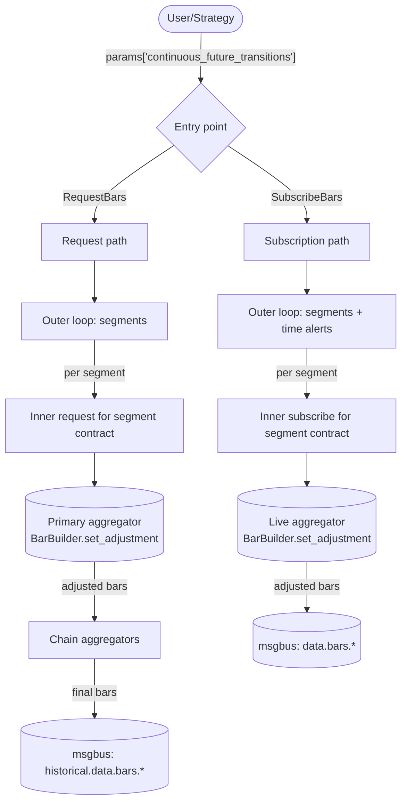
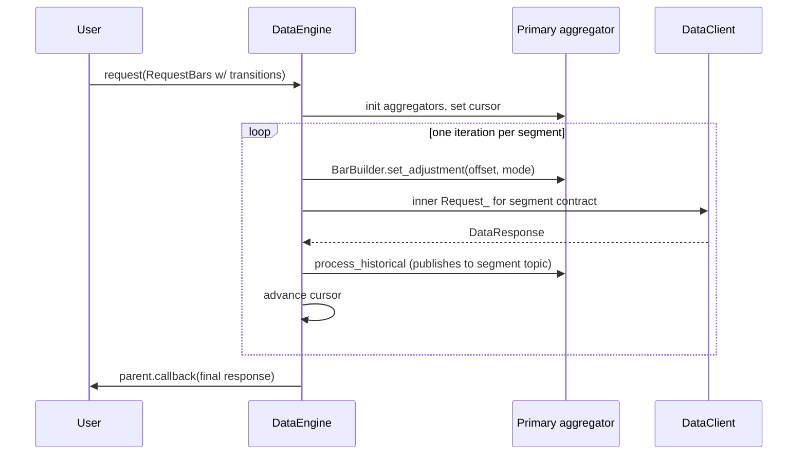
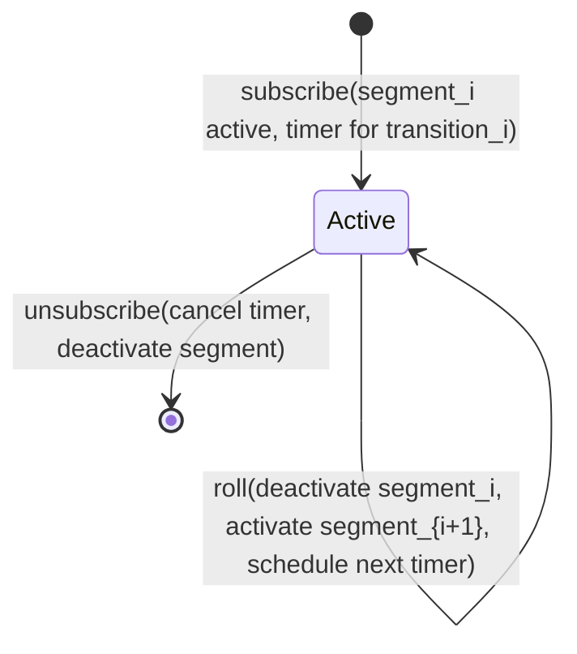
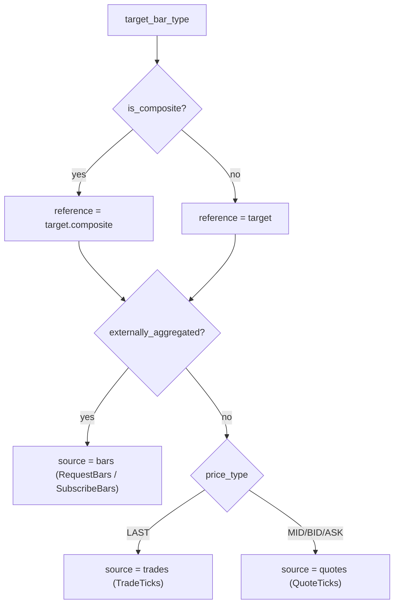
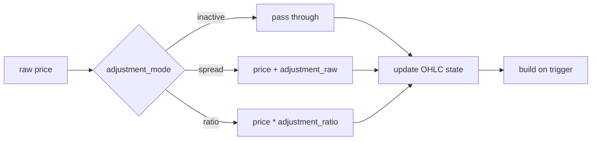

# Continuous Futures

> 本文档为 [English 原文](../../docs/concepts/continuous_futures.md) 的中文翻译版本。如有歧义请以英文原版为准。

连续期货是一种衍生序列，它把若干连续的期货合约拼接为一个经过调整的价格流。每一份底层合约都会到期；
连续序列通过在过渡点滚动到下一份合约并将历史价格平移到新合约的坐标系中，从而保持持续活跃，
最终得到的序列没有因换月引起的跳跃。

Nautilus 将连续期货建模为一个目标 `BarType` 加上在 request 或 subscribe 参数中显式提供的换月过渡列表。
数据引擎按合约段逐段处理，计算每段的累计价格调整量，并将调整后的源数据送入正常的 K 线聚合路径。

## 调整模式

`ContinuousFutureAdjustmentType` 将方向（backward 或 forward）与运算方式（spread 或 ratio）组合：

| 模式              | 运算方式       | 锚定段              |
|-------------------|----------------|---------------------|
| `BACKWARD_SPREAD` | 加法           | 最近的合约           |
| `FORWARD_SPREAD`  | 加法           | 首个合约             |
| `BACKWARD_RATIO`  | 乘法           | 最近的合约           |
| `FORWARD_RATIO`   | 乘法           | 首个合约             |

第 `k` 段（共 `N` 个过渡）的累计调整量为：

```text
BACKWARD_SPREAD: sum over i in [k, N) of (post_i - pre_i)
FORWARD_SPREAD:  sum over i in [0, k) of (pre_i - post_i)
BACKWARD_RATIO:  product over i in [k, N) of (post_i / pre_i)
FORWARD_RATIO:   product over i in [0, k) of (pre_i / post_i)
```

Spread 模式累计加法偏移；ratio 模式累计乘法因子，并要求价格严格为正。

## 输入

连续期货请求或订阅是任何在 `params` 中携带 `continuous_future_transitions` 条目的
`RequestBars` 或 `SubscribeBars`：

```python
params = {
    "continuous_future_transitions": [
        {
            "transition_time_ns": 1773671460000000000,  # ESH26 滚动到 ESM26 的时刻
            "pre_instrument_id": "ESH26.XCME",
            "post_instrument_id": "ESM26.XCME",
            "pre_price": "6001.00",                     # 滚动前 ESH26 的最后价格
            "post_price": "5995.50",                    # 滚动后 ESM26 的首个价格
        },
        # ... 更多过渡 ...
    ],
    "continuous_future_adjustment_mode": ContinuousFutureAdjustmentType.BACKWARD_SPREAD,
    # 可选：将累计调整的上端限制在 post_instrument_id 匹配的过渡（即 backward 模式的锚定点）
    # "last_post_instrument_id": "ESM26.XCME",
    # 可选：将累计调整的下端限制在 pre_instrument_id 匹配的过渡（即 forward 模式的锚定点）
    # "first_pre_instrument_id": "ESM26.XCME",
}
```

请求或命令上的 `bar_type` 是**目标**连续 K 线类型，例如
`"ES.XCME-1-MINUTE-LAST-INTERNAL@1-MINUTE-EXTERNAL"`。根标识符（`ES.XCME`）是连续根，
而非真实合约。每段的原始源数据来自过渡列表中的真实合约。

连续目标 K 线类型必须是**内部聚合**的。外部聚合 K 线不支持作为连续目标，但可以作为每段的源数据。

### 有界链

两个可选边界对过渡表的活跃部分进行限制：

- `last_post_instrument_id` 将上端限制在 `post_instrument_id` 匹配的第一个过渡。Backward 模式以其作为锚点
  （锚定段的累计调整为零）；forward 模式则用它来限制后续合约累计调整的范围。
- `first_pre_instrument_id` 将下端限制在 `pre_instrument_id` 匹配的第一个过渡。Forward 模式以其作为锚点；
  backward 模式则用它来限制早期合约累计调整的范围。

这样调用方可以传入一个宽泛的过渡表，同时把调整后的序列锚定到任一侧的特定合约上。

## 校验

两个入口在分配任何聚合器之前都会执行 `engine.pyx::_continuous_future_validate_transitions`：

- `continuous_future_adjustment_mode` 必须能解析为有效的 `ContinuousFutureAdjustmentType`。
- `continuous_future_transitions` 必须是 dict 行组成的 list 或 tuple。
- 每一行必须包含非负整数 `transition_time_ns`，并且过渡时间必须严格递增。
- 每个 `pre_instrument_id` 和 `post_instrument_id` 必须能解析为合法的 `InstrumentId`，且其 venue 等于目标 venue。
- 链必须连续：第 `i` 行的 `post_instrument_id` 必须等于第 `i + 1` 行的 `pre_instrument_id`。
- 每一行必须包含有限的 `pre_price` 与 `post_price`。Ratio 模式额外要求两个价格都为正。
- 如果调用方提供了 `last_post_instrument_id`，它必须能解析为 `InstrumentId`，匹配目标 venue，
  并出现在过渡列表中作为 `post_instrument_id`。`first_pre_instrument_id` 同理。

校验失败时，辅助函数会记录具体错误并返回。请求处理器还会调用 `_abort_request` 以丢弃任何已开始建立的工作流状态。

## 目标 instrument 自动合成

连续根（例如 `ES.XCME`）是一个没有自己市场数据的合成 ID，但下游消费者（聚合器、缓存查找、序列化）
仍然期望缓存中存在一个 `Instrument`。校验之后，两个入口都会调用
`engine.pyx::_continuous_future_ensure_target_instrument`：

- 如果目标 ID 已经在缓存中，该辅助函数不做任何事。调用方可以预先注册一个自定义的连续 instrument，
  引擎会尊重它。
- 否则，辅助函数从缓存中获取第一段的 instrument，并通过 `FuturesContract.to_dict_c` 和 `from_dict_c`
  克隆它，仅覆盖 `id`、`raw_symbol`，并将 `activation_ns` 和 `expiration_ns` 清零。
  其他字段（货币、精度、增量、乘数、手数、标的资产、费用、保证金、交易所、tick 方案、info）
  都从该段复用。
- 如果第一段尚未在缓存中，或不是 `FuturesContract`，辅助函数会记录警告并返回。
  调用方必须手动注册连续 instrument。

## 架构概览



整个设计包含：两个入口、一种外层循环形态（遍历各段）、两种获取每段数据的方式（历史子请求或实时子订阅），
以及一套调整机制（在每个段边界调用 `BarBuilder.set_adjustment`）。

## 段

**段**是由一个真实合约拥有的连续时间切片。过渡分隔各段。给定 `transitions[0..N)`：

- 段 0：`(-inf, transitions[0].time)`，由 `transitions[0].pre_instrument_id` 拥有。
- 段 k，其中 k 属于 `[1, N)`：`[transitions[k-1].time, transitions[k].time)`，
  由 `transitions[k].pre_instrument_id` 拥有。
- 段 N：`[transitions[N-1].time, +inf)`，由 `transitions[N-1].post_instrument_id` 拥有。

`engine.pyx::_continuous_future_next_segment` 返回从 `cursor_ns` 开始、被 `end_ns` 截断的下一段。

## 请求流程

请求路径在更高一层上类似 `_handle_long_request`：每次迭代为一段数据触发一个内部请求，
内部请求的完成回调推进游标。



如果调用方在 params 中设置了 `time_range_generator` 和 `durations_seconds`，内部请求会继承它们，
并自身变成一个把段时间范围切分为 N 个更小子请求的长请求。外层连续期货循环忽略内部切分：
每个内部请求仍然只发出一个组合后的响应，从而触发外层循环进入下一段。

### 链式聚合器

如果调用方为多层内部聚合设置了 `bar_types = (bar_type_1, bar_type_2)`，
设置过程会创建所有以 `parent.id` 为键的聚合器。主聚合器（链的底部）通过逐段的 msgbus 订阅接收源数据。
它发出的 K 线会发布到下一层订阅的历史主题，于是链自动逐级向上。
只有主 builder 上会调用 `set_adjustment`；更高层是对已调整的数据进行再聚合。

## 订阅流程

每个活跃订阅由一个待发的时间告警驱动一个小型状态机：



当一个过渡触发时，引擎会停用当前段（取消订阅源）、激活下一段（解析新源、应用新偏移、订阅），
并为下一次过渡重置定时器。

## 源数据解析

对任意连续期货目标 `BarType`，馈给主聚合器的原始数据存在于**段合约**上，而不是连续 ID 上。
目标的形态决定源类型：



## BarBuilder 调整

Builder 在每次 `update(price, ...)` 与 `update_bar(bar, ...)` 调用时**于入口处**应用调整。
持续运行的 OHLC 状态始终位于已调整（公共）坐标系中，因此 K 线中途的调整变更只影响后续价格。
不需要任何对当前未完成 K 线的缓冲。



`BarBuilder` 只关心 ratio-vs-spread 区分以决定加法或乘法。在调用 `set_adjustment` 之前，
引擎会把方向信息压缩为累计偏移的符号与大小。`reset()` 方法清理用于下一根 K 线的 per-bar OHLCV 状态，
但有意保留调整配置：滚动远比 K 线重置发生得少，因此调整被视为段范围内的状态。

## K 线内部的滚动边界

如果滚动落在进行中的目标 K 线内部，builder 会保留当前 OHLC 状态，仅对后续更新应用新的调整。
边界之前的部分保留旧偏移，边界之后的部分使用新偏移。这是有意为之的策略：在每次滚动时改写运行中的 OHLC
将要求对每段原始输入进行缓冲，这会增加成本，但对于跨边界无缝构建调整段的常见情形并不会改变结果。

## 限制

- 该特性要求由调用方提供过渡元数据。引擎不会发现滚动、不选择合约，也不推断滚动价格：
  这些都是调用方的责任。
- Ratio 调整在热点路径上经过 `float`（`price_as_f64 * ratio` 然后 `price_new`）。
  对于高精度标的，舍入误差可能使最终的 raw 值相对等价的 `Decimal` 乘法偏差 1 ULP。
  Spread 模式是精确的，因为它直接作用于 `PriceRaw`（int64/int128）。
