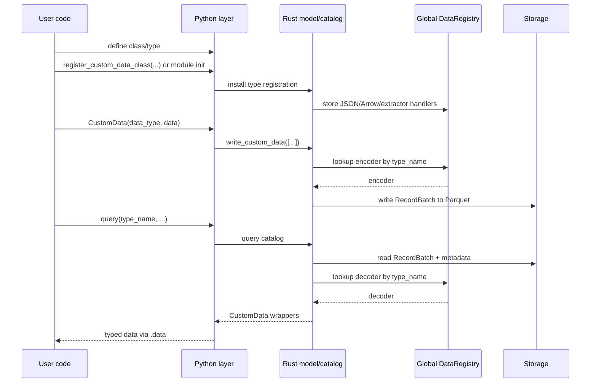
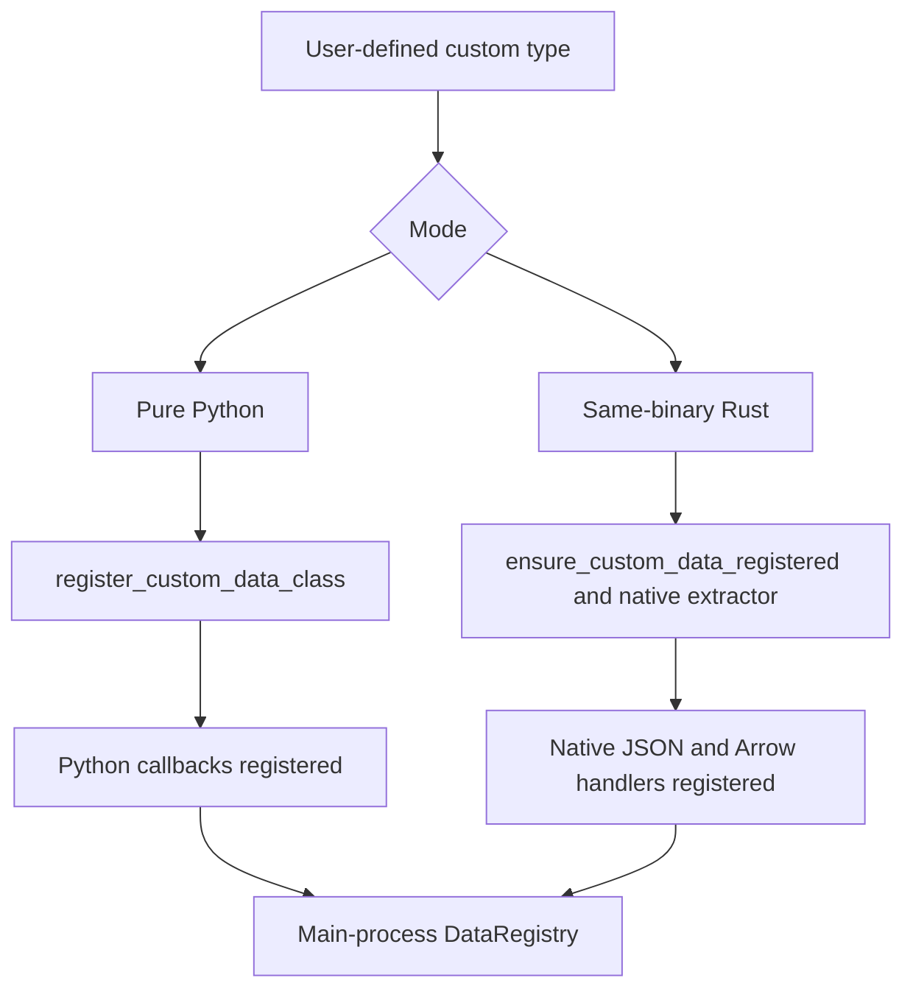
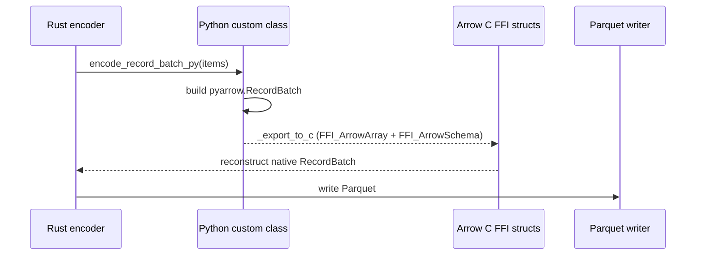

# Custom Data

> 本文档为 [English 原文](../../docs/concepts/custom_data.md) 的中文翻译版本。如有歧义请以英文原版为准。

Nautilus Trader 支持使用 Python 和 Rust 编写的自定义数据，并通过与平台其余部分相同的运行时、持久化与查询流水线来传输这些数据。

本文档介绍自定义数据如何：

- 在运行时注册。
- 跨 Python/Rust 边界包装。
- 与 Arrow/Parquet 之间序列化。
- 通过 actor 和策略路由。

## 目标

自定义数据架构满足以下需求：

- 允许用户用纯 Python 定义自定义数据，无需编写 Rust 代码。
- 允许由 Rust 定义的自定义数据使用原生的 Rust JSON 和 Arrow 处理器。
- 在 PyO3 边界保留单一面向用户的 `CustomData` 包装器。
- 通过动态类型注册而非硬编码 schema 来支持在 `ParquetDataCatalog` 中的持久化。
- 让自定义数据通过常规的数据引擎、actor 和策略订阅流路由。

## 总体模型

支持两种编写模式：

| 模式            | 示例                                               | 注册路径                                                  | 编解码路径                       | 包装器后端                |
|-----------------|----------------------------------------------------|---------------------------------------------------------|---------------------------------|---------------------------|
| 纯 Python       | `@customdataclass_pyo3` 类                         | `register_custom_data_class(...)`                       | Python 回调 + Arrow C FFI       | `PythonCustomDataWrapper` |
| 同二进制 Rust   | `#[custom_data]` 或 `#[custom_data(pyo3)]` 类型    | `ensure_custom_data_registered::<T>()` 及原生提取器     | 原生 Rust                       | 原生 Rust 载荷            |

两种模式最终都汇聚到同一个外层 PyO3 `CustomData` 包装器和同一个 `DataType` 标识模型。

## 端到端流程

## 核心组件

### `DataRegistry`

`crates/model/src/data/registry.rs` 是主进程中自定义数据的中心运行时注册模块。
注册使用原子的 `DashMap::entry()`，因此并发的 `register_*` 与 `ensure_*` 调用不会发生竞争。

该模块包含若干由 `OnceLock` 初始化的 `DashMap` 单例：

- 按 `type_name` 键的 JSON 反序列化器。
- 按 `type_name` 键的 Arrow schema、编码器与解码器。
- 把 Python 对象转换为 `Arc<dyn CustomDataTrait>` 的 Python 提取器。
- 为同二进制类型生成 Python 提取器的 Rust 提取器工厂。

Nautilus 不会把每个类型硬编码到主二进制中，而是在运行时使用 `DataType` 与 Parquet 元数据中存储的 `type_name` 解析处理器。

### `CustomData`

外层 PyO3 `CustomData` 包装器是跨越 FFI 边界的通用容器。

构造函数签名：`CustomData(data_type, data)`，其中 `DataType` 在前，内层载荷在后。

它包含：

- 一个 `DataType`。
- 一个实现 `CustomDataTrait` 的内层自定义载荷（包装在 `Arc<dyn CustomDataTrait>` 中）。

时间戳（`ts_event`、`ts_init`）委托给内层 `CustomDataTrait` 实现，并作为包装器上的属性暴露。

在 Python 一侧，`CustomData` 暴露值语义：实现了 `__eq__` 与 `__repr__`（相等性使用 Rust 的 `PartialEq` 逻辑）。
实例被有意设为不可哈希，以使相等性与内层载荷比较保持一致。

该包装器在两种自定义数据模式间共享。用户代码通过同一套 API 交互，尽管底层载荷可能是：

- Python 支持的包装器。
- 同二进制 Rust 值。

#### `CustomData` JSON 信封

序列化为 JSON 时（例如 `to_json_bytes` / `from_json_bytes`、SQL 缓存或 Redis），
`CustomData` 使用单一规范信封，使反序列化不依赖用户载荷字段名：

- `type`：自定义类型名（来自 `CustomDataTrait::type_name`）。
- `data_type`：包含 `type_name`、`metadata` 和可选 `identifier` 的对象。
- `payload`：仅为内层载荷（`CustomDataTrait::to_json` 解析为一个 JSON 值后的结果）。
  注册的反序列化器在 `from_json` 中只接收该值，因此用户 struct 可以使用任意字段名（包括 `value`）而不与包装器元数据冲突。

该信封由 Rust 的 `CustomData` 序列化产生，并由 `DataRegistry` 在从 JSON 反序列化自定义数据时消费。

### `DataType`

`DataType` 用于路由与持久化中识别自定义数据。

构造函数：`DataType(type_name, metadata=None, identifier=None)`。

它包含：

- `type_name`。
- 可选的 `metadata`。
- 可选的 `identifier`（仅用于 catalog 路径，不用于路由或相等性比较）。

相等性、哈希、消息主题路由仅依据 `type_name` 与 `metadata`。
相同 `type_name` 和 `metadata` 但 `identifier` 不同的两个 `DataType` 视为相等，并发布到同一个消息总线主题。
`identifier` 只影响 `data/custom/<type_name>/<identifier...>` 这样的存储路径。

自定义数据的存储和查询使用 `DataType`，而不仅仅是 Rust/Python 类名。
这使得同一逻辑类型可以以不同的 metadata 或 identifier 存储，同时仍由同一个已注册的处理器解码。

## 注册架构

注册在 Python 对象与 Rust trait 对象之间架起桥梁。

### 纯 Python 注册

当 Python 代码调用 `register_custom_data_class(MyType)`：

1. 该类型在 Python 序列化层注册，以支持 JSON 与 Arrow。
2. Rust 注册一个 Python 提取器，将 Python 实例包装为 `PythonCustomDataWrapper`。
3. Rust 在 `DataRegistry` 中注册 Arrow schema/编码/解码回调。

该路径灵活、对用户友好，但 Arrow 编码与重建依赖 Python 回调。

### 同二进制 Rust 注册

对于在 Nautilus 内部定义的 Rust 类型：

1. `#[custom_data]` 或 `#[custom_data(pyo3)]` 生成必要的 trait、JSON 与 Arrow 实现。
2. `ensure_custom_data_registered::<T>()` 把原生 schema/编码器/解码器处理器插入 `DataRegistry`。
3. 对 PyO3 暴露的类型，原生提取器可以把 Python 实例转换回具体的 Rust 类型，而不是回退到 Python 包装器。

该路径在编码/解码上完全保持在 Rust 原生。

### 注册优先级

`register_custom_data_class(...)` 按以下顺序解析类型：

1. 同二进制原生 Rust 注册。
2. 纯 Python 回退注册。

该顺序为主二进制已原生知晓的类型保留最快可用路径。

## 包装器后端

在内部，外层 `CustomData` 包装器可以持有不同的载荷实现。

### `PythonCustomDataWrapper`

用于纯 Python 自定义数据。

职责：

- 存储 Python 对象的引用。
- 缓存 `ts_event`、`ts_init` 与 `type_name`。
- 实现 `CustomDataTrait`。
- 在 GIL 下调用 Python 方法处理 JSON 与 Arrow 相关操作。

当主进程没有该类型的原生 Rust 表示时，使用此回退路径。

### 原生同二进制 Rust 载荷

对于编译进 Nautilus 的 Rust 类型，内层载荷就是具体的 Rust 类型本身，可以直接从 `Arc<dyn CustomDataTrait>` 向下转型。

序列化与解码均无需经过 Python 回调路径。

## 持久化架构

### 为什么需要动态 Arrow 注册

Nautilus 内置数据类型的 schema 和编码器对 Rust 二进制是静态已知的。自定义数据则不是。
因此持久化层使用已注册的 `type_name` 动态解析自定义数据。

### Catalog 写入流程

`ParquetDataCatalog` 期望自定义写入以 `CustomData` 值形式传入。

自定义数据写入路径：

1. 从 `DataType` 中提取 `type_name`、`metadata` 和 `identifier`。
2. 在 `DataRegistry` 中查找 Arrow 编码器。
3. 把值编码为 `RecordBatch`。
4. 追加一个包含持久化 `DataType` 的 `data_type` 列。
5. 将 `type_name` 与 metadata 附加到 Arrow schema 上。
6. 把批次写入自定义数据路径下的 Parquet。

路径布局：

- `data/custom/<type_name>/<identifier...>`

Identifier 在成为路径段之前会被规范化。

### Catalog 读取流程

查询时：

1. catalog 读取匹配的 Parquet 文件。
2. 从 schema metadata 中提取 `type_name`。
3. 向 `DataRegistry` 请求已注册的解码器。
4. 将 `RecordBatch` 解码为 `Vec<Data>`。
5. 用原始 `DataType` 重建 `CustomData`。

这使得自定义数据的查询解析与写入时的注册保持对称。
当把 Feather 流（例如回测后的）转换为 Parquet 时，自定义数据分支会解码批次并通过
`write_custom_data_batch` 写入，使通过 Feather writer 写入的自定义数据正确转换为 Parquet。

## Arrow C FFI 桥接

纯 Python 自定义数据无法直接提供原生 Rust 的 Arrow 编码逻辑。
对这些类型，Nautilus 使用 Arrow C FFI 接口在 Python 与 Rust 之间传递 `RecordBatch` 数据，避免序列化开销。

### 纯 Python 编码路径

对纯 Python 类：

1. Rust 获取 GIL。
2. Rust 调用 Python 类的 `encode_record_batch_py(...)`。
3. Python 将对象转换为 `pyarrow.RecordBatch`。
4. Python 通过 `_export_to_c` 将批次导出为 Arrow C FFI struct。
5. Rust 从 FFI struct 重建原生 `RecordBatch` 并写入。

### 纯 Python 解码路径

反向：

1. Rust 把它的 `RecordBatch` 转为 Arrow C FFI struct。
2. Python 通过 `RecordBatch._import_from_c` 导入批次。
3. Python 调用类的 `decode_record_batch_py(metadata, batch)`。
4. Rust 把返回的 Python 对象包装在 `PythonCustomDataWrapper` 中。

### 原生路径

Arrow C FFI 桥不适用于同二进制 Rust 自定义数据。这些类型使用在主进程中注册的原生 Rust 编码/解码处理器。

## 查询时的重建

当自定义数据从 catalog 加载回来时，重建依赖后端：

- 同二进制 Rust 类型直接解码为原生 Rust 值。
- 纯 Python 类型通过 `from_dict` 或 `from_json` 经由已注册的 Python 类重建。

无论哪种情况，调用方在 PyO3 API 边界上都接收到同一个外层 `CustomData` 包装器。

## 运行时集成

自定义数据不仅是持久化特性，还参与 Nautilus 运行时的路由。

相关集成包括：

- `crates/data/src/engine/mod.rs` 通过消息总线发布 `CustomData`。
- `crates/common/src/msgbus/switchboard.rs` 根据 `DataType` 派生自定义主题。
- `crates/common/src/actor/*` 把自定义数据路由到 actor 订阅。
- `crates/trading/src/python/strategy.rs` 把自定义数据暴露给 Python 策略的 `on_data`。
- `crates/backtest/src/engine.rs` 把 `Data::Custom` 视为数据引擎投递的输入，而非交易所路由的数据。

注册过的自定义类型可以通过与其他数据家族相同的运行时接口进行持久化、查询、订阅和消费。

## SQL 缓存与数据库集成

SQL 缓存/数据库层也支持 `CustomData`。

当前行为：

- PostgreSQL 在 `custom` 表中存储自定义数据。
- 存储的记录包含 `data_type`、`metadata`、`identifier` 与完整的 JSON 载荷。
- 读取时使用 `CustomData::from_json_bytes(...)` 重建 `CustomData`。
- Python SQL 绑定暴露 `add_custom_data` 与 `load_custom_data`。
- Redis 缓存把自定义数据存储在 `custom:<ts_init_020>:<uuid>` 这种 key 下，值为完整的 `CustomData` JSON。
- Redis 的 `add_custom_data` 与 `load_custom_data` 按 `DataType`（type_name、metadata、identifier）过滤，
  并按 `ts_init` 排序返回；通过 PyO3 的 `RedisCacheDatabase` API 暴露。

## Cython 自定义数据

Cython 的 `@customdataclass` 系统独立于本架构。本文档描述的是 PyO3 自定义数据系统：

- PyO3 `CustomData`。
- 动态运行时注册。
- Arrow/Parquet 持久化。
- 原生 Rust 执行路径。

## 实际意义

这种架构赋予 Nautilus 两个重要特性：

1. 对仅希望使用 Python 的用户提供 Python 优先的可扩展性。
2. 为内置或编译的自定义类型提供原生 Rust 性能。

最终形成一个概念统一的自定义数据系统，但具有两种后端，而不是为仅 Python 和仅 Rust 数据类型各自维护独立功能仓。
