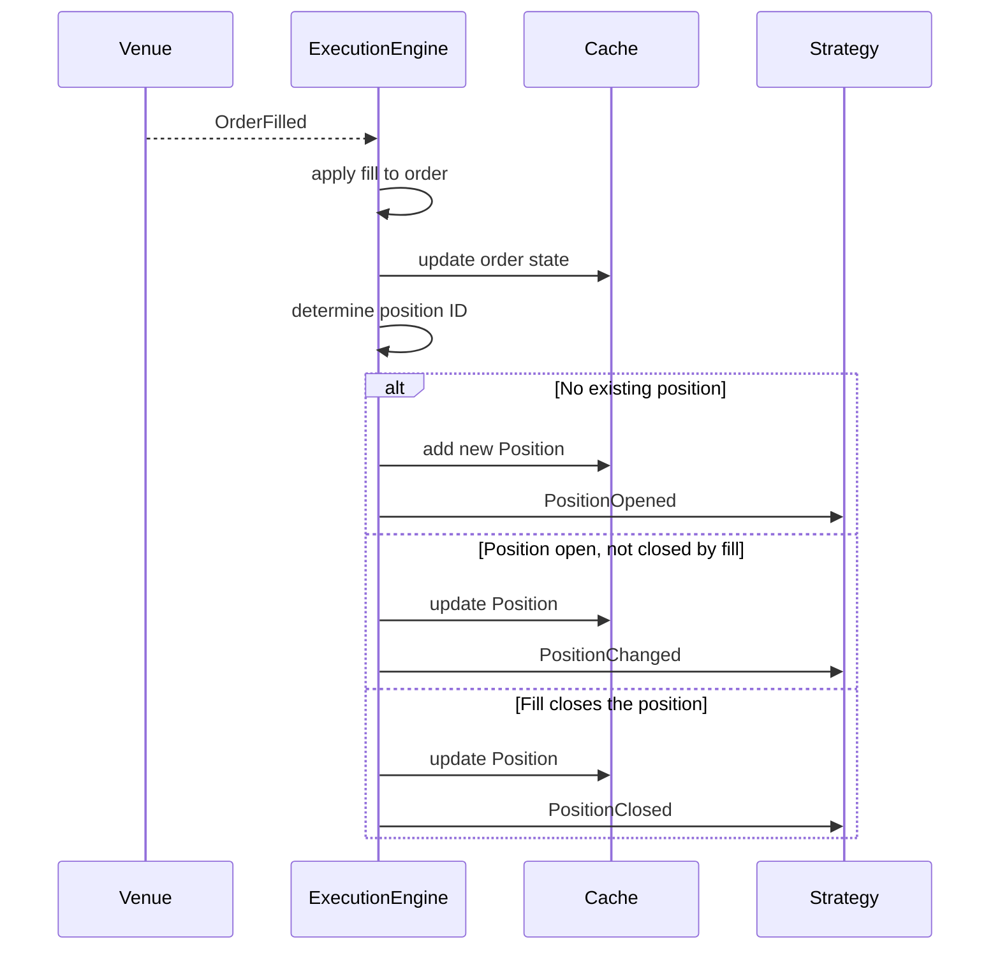

# 事件

> 本文档为 [English 原文](../../docs/concepts/events.md) 的中文翻译版本。如有歧义请以英文原版为准。

Nautilus 是事件驱动的：系统中每一次状态变化都由一个事件对象表示，并通过 `MessageBus` 流向策略与 actor 的处理器。本指南介绍事件类型、它们如何被派发，以及订单成交如何产生持仓事件。

## 事件类别

| 类别     | 示例                                              | 来源                              |
|----------|---------------------------------------------------|-----------------------------------|
| 订单     | `OrderAccepted`、`OrderFilled`、`OrderCanceled`   | `ExecutionEngine`（来自交易场所） |
| 持仓     | `PositionOpened`、`PositionChanged`               | `ExecutionEngine`（来自成交）     |
| 账户     | `AccountState`                                    | `ExecutionClient` / `Portfolio`   |
| 时间     | `TimeEvent`                                       | `Clock`（定时器与告警）           |

## 处理器派发

当一个事件到达策略时，系统按固定的优先级顺序调用处理器。第一个匹配的处理器先运行，然后是下一级，因此你可以以任意需要的粒度处理事件。

### 订单事件

1. 特定处理器（例如 `on_order_filled`）
2. `on_order_event`（接收所有订单事件）
3. `on_event`（接收所有事件）

### 持仓事件

1. 特定处理器（例如 `on_position_opened`）
2. `on_position_event`（接收所有持仓事件）
3. `on_event`（接收所有事件）

### 时间事件

定时器与告警会产生 `TimeEvent` 对象。在调用 `set_timer` 或 `set_time_alert` 时传入一个 `callback`，可将事件指向你自己的方法。如果省略 callback，事件会被投递给 `on_event`。

## 订单事件

每一个订单事件对应 [订单状态机](orders.md#order-state-flow) 中的一次状态转换。`ExecutionEngine` 将事件应用到订单，更新 `Cache`，并将其发布到 `MessageBus`。下表展示主要的转换；部分成交与触发后的订单支持额外的转换，详见完整的 [订单状态流](orders.md#order-state-flow)。

| 事件                   | 主要转换                              | 处理器                       |
|------------------------|---------------------------------------|----------------------------|
| `OrderInitialized`     | （本地创建）                          | `on_order_initialized`     |
| `OrderDenied`          | Initialized -> Denied                 | `on_order_denied`          |
| `OrderEmulated`        | Initialized -> Emulated               | `on_order_emulated`        |
| `OrderReleased`        | Emulated -> Released                  | `on_order_released`        |
| `OrderSubmitted`       | Initialized/Released -> Submitted     | `on_order_submitted`       |
| `OrderAccepted`        | Submitted -> Accepted                 | `on_order_accepted`        |
| `OrderRejected`        | Submitted -> Rejected                 | `on_order_rejected`        |
| `OrderTriggered`       | Accepted -> Triggered                 | `on_order_triggered`       |
| `OrderPendingUpdate`   | Accepted -> PendingUpdate             | `on_order_pending_update`  |
| `OrderPendingCancel`   | Accepted -> PendingCancel             | `on_order_pending_cancel`  |
| `OrderUpdated`         | PendingUpdate -> Accepted             | `on_order_updated`         |
| `OrderModifyRejected`  | PendingUpdate -> Accepted             | `on_order_modify_rejected` |
| `OrderCancelRejected`  | PendingCancel -> Accepted             | `on_order_cancel_rejected` |
| `OrderCanceled`        | PendingCancel/Accepted -> Canceled    | `on_order_canceled`        |
| `OrderExpired`         | Accepted -> Expired                   | `on_order_expired`         |
| `OrderFilled`          | Accepted -> Filled/PartiallyFilled    | `on_order_filled`          |

### 订单事件的通用字段

所有订单事件共享以下字段：

| 字段                | 描述                                       |
|---------------------|------------------------------------------|
| `trader_id`         | 交易者实例标识符。                          |
| `strategy_id`       | 提交订单的策略。                            |
| `instrument_id`     | 订单对应的标的。                            |
| `client_order_id`   | 客户端分配的订单标识符。                     |
| `venue_order_id`    | 交易场所分配的订单标识符。                   |
| `account_id`        | 订单所属账户。                              |
| `reconciliation`    | 是否在对账期间生成。                        |
| `event_id`          | 唯一事件标识符。                            |
| `ts_event`          | 事件发生时的时间戳。                        |
| `ts_init`           | 事件创建时的时间戳。                        |

各个事件会增加类型特定的字段（例如 `OrderFilled` 增加 `last_qty`、`last_px`、`trade_id`、`commission`）。完整的字段列表请参阅每种事件类型的 API 参考。

:::tip
重写 `on_order_event` 可在一处处理所有订单事件。特定处理器先触发，因此你可以混合使用两种方式。
:::

## 持仓事件

持仓事件是成交事件的直接结果。`ExecutionEngine` 处理每一个 `OrderFilled`，更新或创建持仓，并发出相应的持仓事件。

| 事件                | 触发时机                                  | 处理器                |
|---------------------|------------------------------------------|-----------------------|
| `PositionOpened`    | 首笔成交创建一个新持仓。                 | `on_position_opened`  |
| `PositionChanged`   | 后续成交改变了数量或方向。               | `on_position_changed` |
| `PositionClosed`    | 成交将数量减少至零。                     | `on_position_closed`  |

### 从成交到持仓：因果链

下图展示一次 `OrderFilled` 事件如何产生一个持仓事件。这是订单管理与持仓跟踪之间的关键连接。



**逐步说明：**

1. **成交到达。** `ExecutionEngine` 从场所适配器接收一个 `OrderFilled` 事件。
2. **订单状态更新。** 引擎将成交应用到订单对象，并将更新后的订单写入 `Cache`。
3. **持仓 ID 解析。** 引擎根据 OMS 类型与策略配置，确定该成交属于哪个持仓。
4. **创建或更新持仓。** 有三种结果：
   - **该 ID 没有对应持仓**：引擎根据该成交创建一个 `Position`，加入 `Cache`，并发出 `PositionOpened`。
   - **持仓存在且成交后仍开启**：引擎将该成交应用到持仓，更新 `Cache`，并发出 `PositionChanged`。
   - **持仓存在且已平仓**（数量归零）：引擎应用成交，更新 `Cache`，并发出 `PositionClosed`。
5. **方向翻转情形。** 当一笔成交反转持仓方向时（例如多头 10 被卖出 15），引擎会将该成交拆分为两部分：一部分平掉原有持仓（`PositionClosed`），另一部分开出新持仓（`PositionOpened`）。

### 持仓事件字段

| 字段                  | Opened | Changed | Closed | 描述                              |
|-----------------------|--------|---------|--------|-----------------------------------|
| `trader_id`           | ✓      | ✓       | ✓      | 交易者实例标识符。                |
| `strategy_id`         | ✓      | ✓       | ✓      | 拥有该持仓的策略。                |
| `instrument_id`       | ✓      | ✓       | ✓      | 持仓对应的标的。                  |
| `position_id`         | ✓      | ✓       | ✓      | 唯一的持仓标识符。                |
| `account_id`          | ✓      | ✓       | ✓      | 持仓所属账户。                    |
| `opening_order_id`    | ✓      | ✓       | ✓      | 开仓订单。                        |
| `closing_order_id`    | -      | -       | ✓      | 平仓订单。                        |
| `entry`               | ✓      | ✓       | ✓      | 开仓成交的方向。                  |
| `side`                | ✓      | ✓       | ✓      | 当前持仓方向。                    |
| `signed_qty`          | ✓      | ✓       | ✓      | 带符号的数量（负数 = 空头）。     |
| `quantity`            | ✓      | ✓       | ✓      | 无符号的持仓数量。                |
| `peak_qty`            | -      | ✓       | ✓      | 持有过的最大数量。                |
| `last_qty`            | ✓      | ✓       | ✓      | 最近一笔成交的数量。              |
| `last_px`             | ✓      | ✓       | ✓      | 最近一笔成交的价格。              |
| `currency`            | ✓      | ✓       | ✓      | 结算货币。                        |
| `avg_px_open`         | ✓      | ✓       | ✓      | 平均开仓价。                      |
| `avg_px_close`        | -      | ✓       | ✓      | 平均平仓价。                      |
| `realized_return`     | -      | ✓       | ✓      | 已实现收益率。                    |
| `realized_pnl`        | -      | ✓       | ✓      | 已实现盈亏。                      |
| `unrealized_pnl`      | -      | ✓       | ✓      | 未实现盈亏。                      |
| `duration_ns`         | -      | -       | ✓      | 持有时长（纳秒）。                |
| `ts_opened`           | -      | ✓       | ✓      | 持仓开仓时间戳。                  |
| `ts_closed`           | -      | -       | ✓      | 持仓平仓时间戳。                  |
| `event_id`            | ✓      | ✓       | ✓      | 唯一事件标识符。                  |
| `ts_event`            | ✓      | ✓       | ✓      | 触发成交的时间戳。                |
| `ts_init`             | ✓      | ✓       | ✓      | 事件创建时间戳。                  |

### 追踪订单与持仓

`Cache` 提供在订单与持仓之间导航的方法：

```python
# From a position, find all orders that contributed fills
orders = self.cache.orders_for_position(position.id)

# From an order, find the position it belongs to
position = self.cache.position_for_order(order.client_order_id)

# The opening order is stored directly on the position
opening_order_id = position.opening_order_id
```

## 账户事件

`AccountState` 事件代表余额与保证金的快照。它们在以下时机触发：

- 交易场所通过执行客户端报告了账户更新。
- `Portfolio` 在持仓更新后重新计算了账户状态（针对启用了 `calculate_account_state` 的保证金账户）。

账户状态包含余额、保证金、账户类型与基础货币。`Portfolio` 在内部订阅这些事件以维护敞口与余额跟踪。

## 事件订阅

除了策略处理器之外，actor 还可以订阅它们不交易的标的的特定事件流。这些订阅直接使用 `MessageBus`，不经过 `DataEngine`。

| 方法                          | 处理器                  | 接收内容                          |
|------------------------------|-----------------------|--------------------------------|
| `subscribe_order_fills()`    | `on_order_filled()`   | 某个标的的所有成交。              |
| `subscribe_order_cancels()`  | `on_order_canceled()` | 某个标的的所有撤销。              |

这些功能对监控 actor 很有用，它们可以跨策略跟踪执行质量或成交率，而不参与订单管理。

详细信息与示例，请参阅 [订单成交订阅](actors.md#order-fill-subscriptions) 与 [订单撤销订阅](actors.md#order-cancel-subscriptions)。

## 相关指南

- [订单](orders.md) —— 订单类型与状态机。
- [持仓](positions.md) —— 持仓生命周期与盈亏。
- [执行](execution.md) —— 执行流程与风控检查。
- [策略](strategies.md) —— 策略中的处理器实现。
- [架构](architecture.md) —— 数据与执行流模式。
