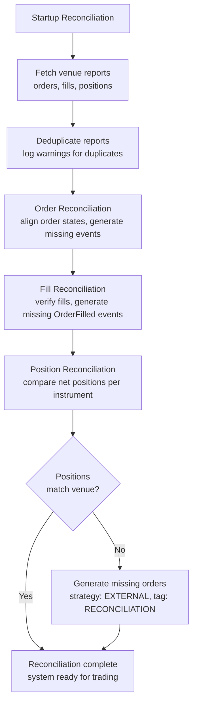

# 实盘交易

> 本文档为 [English 原文](../../docs/concepts/live.md) 的中文翻译版本。如有歧义请以英文原版为准。

NautilusTrader 可在无需修改代码的情况下，将经过回测的策略部署到实盘市场。
相同的 actor、策略与执行算法既可以运行在回测引擎上，也可以运行在实盘交易节点上。

**实盘交易涉及真实的资金风险。在部署到生产之前，请理解系统配置、节点运维、执行对账以及回测与实盘交易之间的差异。**

## 配置

关于配置结构体如何处理默认值、`T` 与 `Option<T>` 的语义以及 builder 模式，请参阅 [配置](configuration.md) 概念指南。
有关 `TradingNodeConfig`、执行引擎选项、策略配置和多场所接线的逐步设置说明，请参阅 [配置实盘交易节点](../how_to/configure_live_trading.md) 操作指南。

## 执行对账

执行对账将交易场所实际的订单与持仓状态与系统基于事件构建的内部状态对齐。只有 `LiveExecutionEngine` 执行对账，因为回测同时控制双方。

:::note[术语]
**在途订单（in-flight order）** 是指等待交易场所确认的订单：

- `SUBMITTED` —— 初次提交，等待接受/拒绝。
- `PENDING_UPDATE` —— 已请求修改，等待确认。
- `PENDING_CANCEL` —— 已请求撤销，等待确认。

这些订单会被持续对账循环监控，以检测过期或丢失的消息。
:::

### 提交结果策略

实盘适配器只有在交易场所提供明确的拒绝证据时，才能发出 `OrderRejected`。例子包括：场所返回的订单响应状态为已拒绝、订单状态报告标记为已拒绝，或者场所返回的错误响应明确确认所提交的订单被拒绝。

如果提交调用失败但场所结果未知，适配器应记录失败日志，并将本地订单保留为在途状态。WebSocket 更新、未结订单轮询、在途检查或启动时的对账必须解析出最终状态。未知结果包括：传输错误、请求超时、断开连接、本地任务被取消、缺失确认、服务器错误，以及在已返回订单 ID 后的提交后查找失败。

对于在向交易场所发送请求前的本地校验，请使用 `OrderDenied`。不要将模糊的提交失败转换为 `OrderRejected`，因为那样会使本地订单进入终态，并阻止后续成交到达策略。

两种场景：

- **存在缓存状态**：报告数据生成缺失事件以对齐状态。
- **无缓存状态**：交易场所上的所有订单与持仓从零开始重新生成。

:::tip
将所有执行事件持久化到缓存数据库。这样可以减少对场所历史的依赖，并允许即使在较短的回看窗口下也能完整恢复。
:::

### 对账配置

除非 `reconciliation` 设置为 false，执行引擎会在启动时对每个交易场所进行状态对账。`reconciliation_lookback_mins` 参数控制引擎请求历史数据的回看深度。

:::tip
保持 `reconciliation_lookback_mins` 不设置。这样引擎会请求交易场所提供的最大执行历史。
:::

:::warning
回看窗口之前的成交仍会生成对齐事件，但会有一些信息损失，而更长的窗口可以避免这种损失。一些交易场所也会过滤或丢弃较旧的执行数据。将所有事件持久化到缓存数据库可避免这两个问题。
:::

每个策略都可以通过 `external_order_claims` 配置参数，认领对账期间为某个标的 ID 生成的外部订单。这让策略能够在没有缓存状态时恢复管理未结订单。

在持仓对账期间生成的、策略 ID 为 `EXTERNAL` 且标签为 `RECONCILIATION` 的订单是引擎内部使用的订单。它们不能通过 `external_order_claims` 认领，也不应该由用户策略管理。

:::tip
要在你的策略中检测外部订单，请检查 `order.strategy_id.value == "EXTERNAL"`。这些订单与任何其他订单一样，会参与组合计算和持仓跟踪。
:::

关于所有实盘交易选项，请参阅 `LiveExecEngineConfig` [API 参考](/docs/python-api-latest/config.html#nautilus_trader.live.config.LiveExecEngineConfig)。

### 对账流程

所有适配器的执行客户端都遵循相同的对账流程，调用三个方法以产生执行总体状态：

- `generate_order_status_reports`
- `generate_fill_reports`
- `generate_position_status_reports`

系统根据这些代表外部现实的报告来对账其状态：

- **重复检查**：
  - 对批次内的订单报告进行去重，并记录警告。
  - 将重复的 trade ID 作为警告记录，便于调查。
- **订单对账**：
  - 生成并应用事件，将订单从缓存状态推进到当前状态。
  - 为缺失的成交报告推断 `OrderFilled` 事件。
  - 为未识别的客户端订单 ID 或缺失客户端订单 ID 的报告生成外部订单事件。
  - 使用带有容差的价格与手续费比较来校验成交报告数据的一致性。
- **持仓对账**：
  - 使用标的精度，将每个标的的净持仓与场所的持仓报告进行匹配。
  - 当订单对账后仍存在与场所不同的持仓时，生成外部订单事件。
  - 当 `generate_missing_orders` 启用时（默认：True），生成策略 ID 为 `EXTERNAL`、标签为 `RECONCILIATION` 的订单以对齐差异。
  - 在生成对账订单时按以下价格优先级回退：
    1. **计算出的对账价格**（首选）：以正确的平均持仓为目标。
    2. **市场中间价**：使用当前买卖盘中间价。
    3. **当前持仓均价**：使用现有持仓的平均价格。
    4. **MARKET 订单**（最后手段）：仅在没有任何价格数据时（无持仓、无行情）使用。
  - 当可以确定价格时（情况 1–3）使用 LIMIT 订单，以保持盈亏（PnL）的准确性。
  - 在精度舍入后跳过数量差为零的情形。
- **部分窗口调整**：
  - 当设置了 `reconciliation_lookback_mins` 时，窗口可能错过开仓成交。
  - 系统使用生命周期分析调整成交，以准确重建持仓：
    - 检测穿越零点（持仓数量穿越 FLAT）以识别独立的生命周期。
    - 当最早的生命周期不完整时，添加合成的开仓成交。
    - 当当前生命周期与场所持仓匹配时，过滤掉已关闭的生命周期。
    - 用一个反映场所持仓的合成成交，替换不匹配的当前生命周期。
  - 合成成交使用计算出的对账价格，以达到正确的平均持仓。
  - 详见 [部分窗口调整场景](#partial-window-adjustment-scenarios)。
- **异常处理**：
  - 单个适配器的失败不会中止整个对账流程。
  - 在订单状态报告之前到达的成交报告会被延迟，直到订单状态可用。

如果对账失败，系统会记录错误并不再启动。

### 常见对账场景

下表覆盖了启动对账（总体状态）以及运行时检查（在途订单检查、未结订单轮询、自有订单簿审计）。

#### 启动对账

| 场景                                   | 描述                                                                                | 系统行为                                                                          |
|----------------------------------------|------------------------------------------------------------------------------------|-----------------------------------------------------------------------------------|
| **订单状态差异**                       | 本地状态与场所不同（例如本地 `SUBMITTED`、场所 `REJECTED`）。                       | 更新本地订单以匹配场所状态，发出缺失事件。                                          |
| **错过的成交**                         | 场所对订单进行了成交，但引擎错过了该事件。                                            | 生成缺失的 `OrderFilled` 事件。                                                    |
| **多次成交**                           | 订单有部分成交，部分被引擎错过。                                                      | 从场所报告中重建完整的成交历史。                                                    |
| **外部订单**                           | 订单在场所存在但本地缓存中没有。                                                      | 创建策略 ID 为 `EXTERNAL`、标签为 `VENUE` 的订单。                                  |
| **部分成交后被撤销**                   | 订单部分成交后被场所撤销。                                                            | 状态更新为 `CANCELED`，保留成交历史。                                               |
| **成交数据不同**                       | 场所报告的成交价格/手续费与缓存不同。                                                 | 保留缓存数据，记录差异。                                                            |
| **被过滤的订单**                       | 通过配置标记为过滤的订单。                                                            | 根据 `filtered_client_order_ids` 或标的过滤跳过。                                  |
| **重复的订单报告**                     | 多个订单共享相同标识符。                                                              | 去重并记录警告。                                                                    |
| **持仓数量不匹配（多）**               | 内部多头持仓与场所不同（例如 100 对 150）。                                          | 当 `generate_missing_orders=True` 时，使用计算出的价格生成 BUY LIMIT。              |
| **持仓数量不匹配（空）**               | 内部空头持仓与场所不同（例如 -100 对 -150）。                                        | 当 `generate_missing_orders=True` 时，使用计算出的价格生成 SELL LIMIT。             |
| **持仓减仓**                           | 场所持仓小于内部（例如内部 150 多头，场所 100 多头）。                                | 使用计算出的价格生成反向 LIMIT 订单。                                               |
| **持仓方向翻转**                       | 内部持仓与场所相反（例如内部 100 多头，场所 50 空头）。                              | 生成 LIMIT 订单以平掉内部并开出外部持仓。                                           |
| **内部对账订单**                       | 策略 ID 为 `EXTERNAL`、标签为 `RECONCILIATION` 的订单。                              | 永远不会被过滤，无论 `filter_unclaimed_external_orders` 如何设置。                  |

#### 运行时检查

| 场景                              | 描述                                                  | 系统行为                                                                  |
|-----------------------------------|------------------------------------------------------|---------------------------------------------------------------------------|
| **模糊的提交失败**                | 提交调用失败，且没有确认的场所拒绝。                  | 记录失败，将订单保持为在途，等待对账。                                    |
| **在途订单超时**                  | 订单超过阈值仍未确认。                                | 经过 `inflight_check_retries` 次重试后，解析为 `REJECTED`。               |
| **未结订单检查差异**              | 周期性轮询检测到场所状态变化。                        | 在 `open_check_interval_secs` 处确认状态并应用状态转换。                  |
| **自有订单簿审计不匹配**          | 自有订单簿与场所公开订单簿出现分歧。                  | 在 `own_books_audit_interval_secs` 处审计，记录不一致。                   |

### 常见对账问题

- **缺失的成交报告**：一些场所会过滤掉较旧的成交。可增加 `reconciliation_lookback_mins`，或在本地缓存所有事件。
- **持仓不匹配**：早于回看窗口的外部订单会导致持仓漂移。在重启前将账户平仓以重置状态。
- **重复订单 ID**：去重后记录警告。频繁出现的重复可能预示场所数据完整性问题。
- **精度差异**：使用标的精度处理细微的小数差异。较大的差异可能预示订单缺失。
- **乱序报告**：在订单状态报告之前到达的成交报告会被延迟，直到订单状态可用。

:::tip
对于反复出现的问题，可在重启前清除缓存状态或将账户平仓。
:::

### 对账不变量

对账系统维护四个不变量：

1. **持仓数量**：最终数量在标的精度范围内与场所相匹配。
2. **平均开仓价格**：持仓的平均开仓价格与场所报告的价格在容差（默认 0.01%）范围内匹配。
3. **盈亏完整性**：所有生成的成交（包括合成成交）都使用计算出的价格，以保持未实现盈亏的正确性。
4. **ID 确定性**：对账期间发出的合成 `trade_id` 与 `venue_order_id` 值是逻辑事件的确定性函数。同一个逻辑成交或持仓调整订单跨重启会生成相同的 ID，因此重放的对账事件会与早期运行去重，而不会被视为新事件。

即使在以下情况下，这些不变量也成立：

- 对账窗口未捕获完整的成交历史。
- 场所报告中缺少成交。
- 持仓生命周期跨越了回看窗口之外。
- 出现过多次穿越零点的情形。

### 部分窗口调整场景

当 `reconciliation_lookback_mins` 限制了窗口时，系统会从成交中分析持仓生命周期，并进行调整以准确重建持仓。

| 场景                                       | 描述                                                                            | 系统行为                                                                     |
|--------------------------------------------|--------------------------------------------------------------------------------|------------------------------------------------------------------------------|
| **完整生命周期**                           | 从开仓到当前状态的所有成交都已捕获。                                              | 无需调整。                                                                   |
| **不完整的单一生命周期**                   | 窗口错过了开仓成交，没有穿越零点。                                                | 使用计算出的价格添加合成开仓成交。                                            |
| **多个生命周期，当前匹配**                 | 检测到穿越零点，当前生命周期与场所匹配。                                          | 过滤掉旧的生命周期，仅返回当前。                                              |
| **多个生命周期，当前不匹配**               | 检测到穿越零点，当前生命周期与场所不同。                                          | 用单一合成成交替换当前生命周期。                                              |
| **平仓状态**                               | 无论成交历史如何，场所报告为 FLAT。                                               | 无需调整。                                                                   |
| **无成交**                                 | 窗口内没有成交报告。                                                              | 无需调整，结果为空。                                                          |

**关键概念：**

- **穿越零点**：持仓数量穿越零（FLAT），标记一个生命周期边界。
- **生命周期**：穿越零点之间的一系列成交，代表一次开仓-平仓循环。
- **合成成交**：表示缺失活动的计算出的成交报告，其价格用于达到正确的平均持仓。
- **容差**：持仓匹配使用可配置的价格容差（默认 0.0001 = 0.01%），以吸收细微的计算差异。

## 相关指南

- [配置实盘交易节点](../how_to/configure_live_trading.md) —— 节点与引擎配置。
- [适配器](adapters.md) —— 场所连接。
- [执行](execution.md) —— 实盘环境下的订单执行。
- [回测](backtesting.md) —— 部署前的策略测试。
