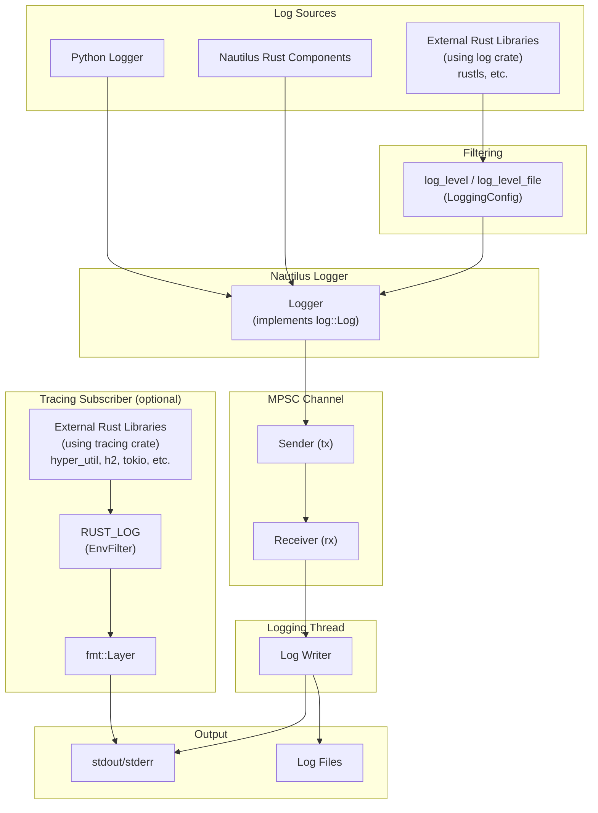

# Logging

> 本文档为 [English 原文](../../docs/concepts/logging.md) 的中文翻译版本。如有歧义请以英文原版为准。

平台为回测与实盘交易提供高性能日志子系统，由 Rust 实现，并通过 `log` crate 提供标准化门面。

核心 logger 在独立线程运行，并使用多生产者单消费者（MPSC）通道接收日志消息。
这种设计确保主线程保持高性能，避免日志字符串格式化或文件 I/O 操作引起的瓶颈。

日志输出可配置，支持：

- **stdout/stderr 写入器**用于控制台输出
- **文件写入器**用于持久化存储日志

:::info
可在系统中集成 [Vector](https://github.com/vectordotdev/vector) 等基础设施来收集和聚合事件。
:::

## 架构

日志子系统从多个源捕获事件，并通过 MPSC 通道路由到专用的日志线程：



- **Python 与 Nautilus 组件**：直接通过 Nautilus Logger 记录日志。
- **使用外部 `log` crate 的库**：由 `LoggingConfig` 中的 `log_level` / `log_level_file` 过滤。
- **使用外部 `tracing` crate 的库**：启用后输出直接到 stdout（与 Nautilus 日志分离），
  由 `RUST_LOG` 环境变量过滤。
- **日志线程**：所有 Nautilus 日志事件通过 MPSC 通道发送到专用线程，确保主线程不被 I/O 阻塞。

## 配置

可通过导入 `LoggingConfig` 对象来配置日志。默认情况下，'INFO' `LogLevel` 及以上的日志事件会写入 stdout/stderr。

日志级别（`LogLevel`）包括以下值（遵循标准日志级别约定）。

支持的日志级别：

- `OFF` - 关闭日志。
- `TRACE` - 最详细；仅 Rust 组件可发出（Python 无法直接生成）。
- `DEBUG` - 详细的诊断信息。
- `INFO` - 一般操作消息。
- `WARNING` - 不会阻断运行的潜在问题。
- `ERROR` - 可能影响功能的错误。

:::tip
即使 Python 代码无法直接发出 `TRACE`，也可以把它作为过滤级别以捕获 Rust 组件的 trace 日志。
:::

更多细节参见 `LoggingConfig` [API 参考](/docs/python-api-latest/config.html#nautilus_trader.common.config.LoggingConfig)。

可以通过以下方式配置日志：

- stdout/stderr 的最低 `LogLevel`。
- 日志文件的最低 `LogLevel`。
- 日志文件轮转前的最大大小。
- 轮转时保留的最大备份日志文件数量。
- 通过日期/时间戳自动命名日志文件，或自定义文件名。
- 日志文件写入目录。
- 纯文本或 JSON 日志文件格式。
- 按组件单独过滤日志级别。
- 日志行 ANSI 颜色。
- 完全跳过日志。
- 初始化时把 Rust 配置打印到 stdout。
- 可选通过 PyO3 桥接（`use_pyo3`）初始化日志，以捕获 Rust 组件发出的日志事件。
- 启动时若日志文件存在则截断（`clear_log_file`）。

### 标准输出日志

日志消息通过 stdout/stderr 写入器写到控制台。可以通过 `log_level` 参数配置最低日志级别。

### 文件日志

日志文件默认写入当前工作目录。命名约定与轮转行为可配置，并根据你的设置按特定模式工作。

可以通过 `log_directory` 指定自定义日志目录，和/或通过 `log_file_name` 指定自定义文件基名。

**日志文件格式**：

- `None`（默认）- 纯文本格式，扩展名 `.log`。
- `"json"` - JSON 格式，扩展名 `.json`，对日志聚合工具有用。

关于日志文件命名约定与轮转行为的详细信息，参见下方 [日志文件轮转](#日志文件轮转) 与 [日志文件命名约定](#日志文件命名约定) 章节。

#### 日志文件轮转

轮转行为取决于是否设置大小限制以及是否提供自定义文件名：

- **基于大小的轮转**：
  - 通过指定 `log_file_max_size` 参数启用（例如 `100_000_000` 表示 100 MB）。
  - 当写入下一条日志会使当前文件超出此大小时，关闭文件并创建新文件。
- **基于日期的轮转（仅默认命名）**：
  - 适用于未指定 `log_file_max_size` 且未提供自定义 `log_file_name` 的情况。
  - 在每个 UTC 日期变化时（午夜），关闭当前日志文件并开始新文件，每 UTC 日一个文件。
- **不轮转**：
  - 当提供自定义 `log_file_name` 但未提供 `log_file_max_size` 时，日志会继续追加到同一文件。
  - 注意：基于大小的轮转优先 —— 如果同时提供自定义名称和大小限制，仍会轮转。
- **备份文件管理**：
  - 通过 `log_file_max_backup_count` 参数（默认 5）控制保留的轮转文件总数。
  - 超出限制时，最旧的备份文件会被自动移除。

#### 日志文件命名约定

默认命名约定确保日志文件唯一可识别并带时间戳。格式取决于是否启用文件轮转：

**启用文件轮转**：

- **格式**：`{trader_id}_{%Y-%m-%d_%H%M%S:%3f}_{instance_id}.{log|json}`
- **示例**：`TESTER-001_2025-04-09_210721:521_d7dc12c8-7008-4042-8ac4-017c3db0fc38.log`
- **各部分**：
  - `{trader_id}`：trader 标识符（如 `TESTER-001`）。
  - `{%Y-%m-%d_%H%M%S:%3f}`：完整的 ISO 8601 兼容日期时间，毫秒分辨率。
  - `{instance_id}`：唯一实例标识符。
  - `{log|json}`：文件后缀，由格式设置决定。

**未启用基于大小的轮转（默认命名）**：

- **格式**：`{trader_id}_{%Y-%m-%d}_{instance_id}.{log|json}`
- **示例**：`TESTER-001_2025-04-09_d7dc12c8-7008-4042-8ac4-017c3db0fc38.log`
- **各部分**：
  - `{trader_id}`：trader 标识符。
  - `{%Y-%m-%d}`：仅日期（YYYY-MM-DD）。
  - `{instance_id}`：唯一实例标识符。
  - `{log|json}`：文件后缀。
- **注**：使用默认命名且无大小限制时，日志在 UTC 午夜每日轮转。

**自定义命名**：

如果设置了 `log_file_name`（例如 `my_custom_log`）：

- 禁用轮转：文件名严格按所提供命名（如 `my_custom_log.log`）。
- 启用轮转：文件名包含自定义名与时间戳（如 `my_custom_log_2025-04-09_210721:521.log`）。

### 组件日志过滤

`log_component_levels` 参数可为每个组件单独设置日志级别。输入应为组件 ID 字符串到日志级别字符串的字典：`dict[str, str]`。

下面是一个包含上述选项的交易节点日志配置示例：

```python
from nautilus_trader.config import LoggingConfig
from nautilus_trader.config import TradingNodeConfig

config_node = TradingNodeConfig(
    trader_id="TESTER-001",
    logging=LoggingConfig(
        log_level="INFO",
        log_level_file="DEBUG",
        log_file_format="json",
        log_component_levels={ "Portfolio": "INFO" },
    ),
    ... # 省略
)
```

对于回测，可以使用 `BacktestEngineConfig` 替代 `TradingNodeConfig`，可用选项相同。

### 通过环境变量配置

`NAUTILUS_LOG` 环境变量提供了使用分号分隔规格字符串来配置日志的另一种方式。
适用于纯 Rust 二进制或希望在不修改代码的情况下覆盖日志设置的场景。

```bash
export NAUTILUS_LOG="stdout=Info;fileout=Debug;RiskEngine=Error;is_colored"
```

**支持的键**：

| 键                    | 类型      | 描述                                              |
|-----------------------|-----------|--------------------------------------------------|
| `stdout`              | 日志级别  | stdout 输出的最高级别。                          |
| `fileout`             | 日志级别  | 文件输出的最高级别。                              |
| `is_colored`          | 标志      | 启用 ANSI 颜色（默认 true）。                     |
| `print_config`        | 标志      | 启动时把配置打印到 stdout。                       |
| `log_components_only` | 标志      | 仅记录有显式过滤器的组件。                        |
| `<Component>`         | 日志级别  | 组件特定级别（精确匹配）。                        |
| `<module::path>`      | 日志级别  | 模块特定级别（前缀匹配，仅 Rust）。               |

标志只要在规格字符串中出现即生效（不需要值）。日志级别不区分大小写：
`Off`、`Trace`、`Debug`、`Info`、`Warning`（或 `Warn`）、`Error`。

:::note
对于纯 Rust 二进制，设置 `NAUTILUS_LOG` 会在首次使用时延迟初始化日志子系统，无需显式调用 `init_logging()`。
:::

### 仅组件日志

当聚焦于嘈杂系统的子集时，启用 `log_components_only` 仅记录 `log_component_levels` 中显式列出的组件的消息。
其他组件无论全局 `log_level` 或文件级别如何都会被抑制。

示例（Python 配置）：

```python
logging = LoggingConfig(
    log_level="INFO",
    log_component_levels={
        "RiskEngine": "DEBUG",
        "Portfolio": "INFO",
    },
    log_components_only=True,
)
```

如果通过 Rust 规格字符串环境变量配置，与组件过滤器一并包含 `log_components_only`，例如：

```bash
export NAUTILUS_LOG="stdout=Info;log_components_only;RiskEngine=Debug;Portfolio=Info"
```

### 模块路径过滤（仅 Rust）

使用 `NAUTILUS_LOG` 环境变量时，除组件名外，还可按 Rust 模块路径过滤。
包含 `::` 的键被视为模块路径过滤器（前缀匹配），不含 `::` 的键为组件过滤器（精确匹配）。

```bash
# 把所有适配器过滤为 Warn，但允许 OKX 为 Debug
export NAUTILUS_LOG="stdout=Info;nautilus_okx=Warn;nautilus_okx::websocket=Debug"
```

最长匹配前缀优先。上例中，`nautilus_okx::websocket::handler` 使用 `Debug` 级别（更长前缀），
而 `nautilus_okx::data` 使用 `Warn`。

:::tip
未提供显式组件时，Rust 日志宏会自动捕获模块路径，使模块级过滤能与标准日志调用一同生效。
:::

:::note
模块路径过滤仅在通过 `NAUTILUS_LOG` 环境变量时可用。Python 的 `log_component_levels` 配置仅支持组件名匹配。
:::

:::warning
如果 `log_components_only=True`（或规格字符串中存在 `log_components_only`）且 `log_component_levels` 为空，
则不会向 stdout/stderr 或文件发出任何日志。请至少添加一个组件过滤器或关闭"仅组件"日志。
:::

### 日志颜色

ANSI 颜色码提高了终端中日志的可读性。
在不支持 ANSI 颜色渲染的环境（如某些云环境或文本编辑器）中，这些颜色码可能显示为原始文本，并不合适。

为应对这种情况，可将 `LoggingConfig.log_colors` 设为 `false`。
关闭 `log_colors` 后，日志消息中不会添加 ANSI 颜色码，避免在不支持颜色的环境中出现原始转义码。

## 直接使用 Logger

可以直接使用 `Logger` 对象，并可在任意位置初始化（与 Python 内置 `logging` API 非常类似）。

如果你***没有***使用 `BacktestEngine` 或 `TradingNode` 之类的对象（它们会自动初始化 `NautilusKernel` 与日志），
可以按如下方式启用日志：

```python
from nautilus_trader.common.component import init_logging
from nautilus_trader.common.component import Logger

log_guard = init_logging()
logger = Logger("MyLogger")
```

更多细节参见 [`init_logging` API 参考](/docs/python-api-latest/common.html)。

:::warning
每个进程只能通过 `init_logging` 调用初始化一次日志子系统。可并存最多 255 个 `LogGuard` 实例，
日志线程会一直运行直到所有 guard 被释放。
:::

## LogGuard：管理日志生命周期

`LogGuard` 确保日志子系统在进程的整个生命周期内保持活跃可用。
在同一进程中运行多个引擎时，它防止日志子系统过早关闭。

### 引用计数实现

日志系统使用引用计数追踪活动的 `LogGuard` 实例：

- **计数递增**：每创建一个新的 `LogGuard`，原子计数器递增。
- **计数递减**：`LogGuard` 被释放时，计数器递减。
- **日志线程终止**：当计数器降至零（最后一个 `LogGuard` 被释放）时，
  日志线程会被妥善 join 以确保所有挂起的日志消息在进程终止前被写出。
- **最大 guard 数**：系统支持最多 255 个并发 `LogGuard` 实例。再创建会抛出 `RuntimeError`。

此机制确保：

1. `LogGuard` 保持日志线程存活，并在 drop 时刷新；突然终止（崩溃、kill 信号）仍可能丢失缓冲日志。
2. 只要存在任意 `LogGuard`，日志线程都保持活跃。
3. 优雅关闭时，所有缓冲日志被正确刷新到目标。

### 为何使用 LogGuard

没有 `LogGuard` 时，在同一进程中尝试运行连续引擎可能出现如下错误：

```
Error sending log event: [INFO] ...
```

这是因为第一个引擎被释放时，日志子系统的底层通道与 Rust `Logger` 已被关闭。
随后引擎无法再访问日志子系统，从而出现此类错误。

通过使用 `LogGuard`，可以确保多个回测或引擎运行在同一进程中保持一致的日志行为。
`LogGuard` 保留日志子系统资源，确保即使引擎被释放与重新初始化，日志仍能正常工作。

:::note
在多引擎进程中，使用 `LogGuard` 是保持一致日志行为所必需的。
:::

## 运行多个引擎

下面的示例演示在同一进程中顺序运行多个引擎时如何使用 `LogGuard`：

```python
log_guard = None  # 初始化 LogGuard 引用

for i in range(number_of_backtests):
    engine = setup_engine(...)

    # 赋值 LogGuard 引用
    if log_guard is None:
        log_guard = engine.get_log_guard()

    # 添加 actor 并运行引擎
    actors = setup_actors(...)
    engine.add_actors(actors)
    engine.run()
    engine.dispose()  # 安全释放
```

### 步骤

- **只初始化一次 LogGuard**：从第一个引擎获取 `LogGuard`（`engine.get_log_guard()`）并在整个进程中保留。
  这确保日志子系统持续活跃。
- **安全释放引擎**：每次回测完成后安全释放引擎。`engine.dispose()` 之后 `LogGuard` 仍然有效 ——
  仅清理引擎，不清理日志子系统。
- **复用 LogGuard**：同一个 `LogGuard` 实例被后续引擎复用，防止日志子系统过早关闭。

### 注意事项

- **每进程多个 LogGuard**：系统支持每进程最多 255 个并发 `LogGuard` 实例。
  每个 guard 创建时递增引用计数，drop 时递减。
- **线程安全**：日志子系统（含 `LogGuard`）是线程安全的，能在多线程环境中保持一致。
- **自动清理**：最后一个 `LogGuard` 被 drop（引用计数归零）时，
  日志线程被妥善 join，确保所有挂起日志在进程终止前写出。

## 用于外部 Rust 库的 tracing subscriber

使用 `tracing` crate 的外部 Rust crate 可以通过启用 tracing subscriber 显示其日志输出。
这对调试外部依赖或集成自定义 Rust 组件（如以独立 PyO3 扩展编译的特征提取器或适配器）非常有用。

### 启用 subscriber

在 `LoggingConfig` 中设置 `use_tracing=True` 来启用 tracing subscriber：

```python
from nautilus_trader.config import LoggingConfig
from nautilus_trader.config import TradingNodeConfig

config_node = TradingNodeConfig(
    trader_id="TESTER-001",
    logging=LoggingConfig(
        log_level="INFO",
        use_tracing=True,
    ),
    ... # 省略
)
```

或者直接调用 `init_tracing()`：

```python
from nautilus_trader.core import nautilus_pyo3

nautilus_pyo3.init_tracing()
```

### 用 RUST_LOG 过滤

`RUST_LOG` 环境变量控制显示哪些 tracing 事件：

```bash
# 显示你的 crate 的 debug 日志，hyper 显示 warn 及以上
RUST_LOG=my_feature_extractor=debug,hyper=warn python my_script.py
```

如果未设置 `RUST_LOG`，默认过滤级别为 `warn`。

### 工作原理

tracing subscriber 使用 `tracing-subscriber` 的 fmt 层配以自定义格式器直接输出到 stdout。
它与 Nautilus 日志基础设施分离 —— tracing 输出使用与 Nautilus 一致的格式，带纳秒时间戳。

tracing 输出示例：

```
2026-01-24T05:51:42.809619000Z [DEBUG] hyper_util::client::legacy::connect::http: connecting to 104.18.5.240:443
2026-01-24T05:51:42.810543000Z [DEBUG] hyper_util::client::legacy::pool: pooling idle connection for ("https", api.example.com)
```

**与 Nautilus 日志的区别**：

- tracing 输出直接到 stdout，不经过 Nautilus 日志线程。
- tracing 事件不会写入 Nautilus 日志文件。
- 过滤仅由 `RUST_LOG` 控制，与 `LoggingConfig` 无关。

对使用 `log` crate 的外部库（如 `rustls`），其事件经过 Nautilus logger，
由 `LoggingConfig` 中的 `log_level` / `log_level_file` 过滤。

:::tip
`RUST_LOG` 仅影响使用 `tracing` 的 crate。对使用 `log` 的 crate，请通过 `LoggingConfig` 或
`NAUTILUS_LOG` 环境变量（如 `NAUTILUS_LOG=stdout=Debug`）配置详细程度。
:::

:::note
tracing subscriber 每个进程只能初始化一次。在 `LoggingConfig` 中使用 `use_tracing=True` 时，
后续 kernel 创建会安全跳过重新初始化。已初始化后再直接调用 `init_tracing()` 会抛错。
:::

## 平台特定注意事项

### Windows 关闭行为

在 Windows 上，解释器关闭期间的非确定性垃圾回收偶尔会阻止日志线程正确 join。
当最后一个 `LogGuard` 被 drop 时，日志子系统通知后台线程关闭并 join 它，
以确保所有挂起消息被写出。如果 Python 垃圾回收器延迟到解释器关闭已开始后才 drop guard，
此 join 可能无法完成，导致日志被截断。

该问题在 GitHub [issue #3027](https://github.com/nautechsystems/nautilus_trader/issues/3027) 中追踪。
正在考虑一种更确定的关闭机制。

## 相关指南

- [Architecture](architecture.md) - 包含日志基础设施的系统架构。
