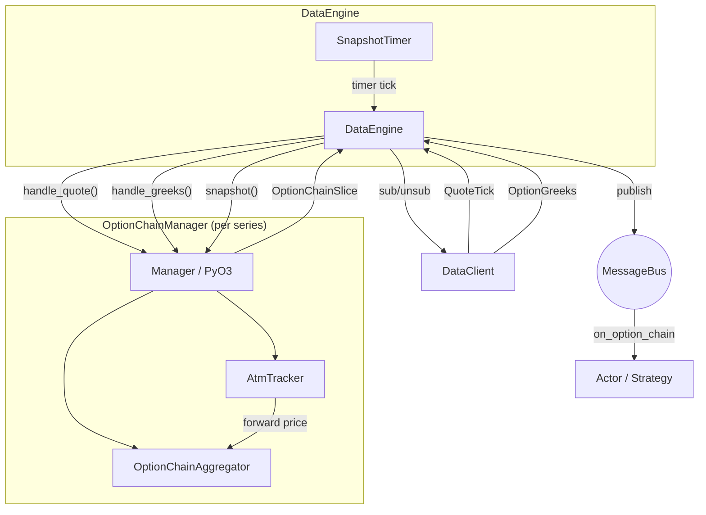

# Options

> 本文档为 [English 原文](../../docs/concepts/options.md) 的中文翻译版本。如有歧义请以英文原版为准。

Nautilus 在传统与加密市场为期权交易提供一流的支持。包括期权特定的 instrument 类型、
场所提供的 Greeks 流式订阅、期权链聚合，以及用于风险管理的本地 Black-Scholes Greeks 计算器。

## 期权 instrument 类型

平台定义了多种期权 instrument 类型：

| Instrument       | 描述                                                                            |
|------------------|---------------------------------------------------------------------------------|
| `OptionContract` | 交易所交易的期权（看跌或看涨），有标的、行权价和到期日。                        |
| `OptionSpread`   | 交易所定义的多腿期权策略（垂直、日历、跨式），作为单个 instrument 报价。        |
| `CryptoOption`   | 加密标的、加密计价/结算的期权；反向或 quanto 形式。                             |
| `BinaryOption`   | 基于二元结果结算为 0 或 1 的固定赔付期权。                                      |

与 Greeks 相关的元数据因 instrument 类型而异：

- `OptionContract`、`CryptoOption`：完整的 Greeks 输入，包括 `strike_price`、
  `option_kind`（CALL/PUT）、`expiration_utc`、`underlying`、`multiplier`。
- `OptionSpread`：最多 4 个期权腿的组合，每条腿按比例加权。包含 `underlying`、`expiration_utc`、
  `strategy_type`（垂直、日历、跨式等）。每条腿的 `strike_price` 和 `option_kind` 位于每条腿的
  `OptionContract` 上，而非价差本身。Greeks 按腿计算并聚合。价差常用于下单
  （交易所作为单笔订单执行），而单独的腿则以持仓形式出现。
- `BinaryOption`：拥有 `expiration_utc` 和 `outcome`/`description`，但没有 `strike_price`、
  `option_kind` 或 `underlying`。

## 订阅 Greeks

Deribit、Bybit、OKX 等场所在其期权市场旁同步发布实时 Greeks。Nautilus 提供两个订阅级别：

- **按 instrument 订阅 Greeks**：订阅单个期权合约。
- **期权链切片订阅**：订阅整个期权系列的聚合视图。

### 按 instrument Greeks

在 actor 或策略中订阅单个期权合约的场所提供 Greeks：

```python
from nautilus_trader.model.identifiers import ClientId

client_id = ClientId("DERIBIT")
self.subscribe_option_greeks(instrument_id, client_id=client_id)
```

通过实现 `on_option_greeks` 处理器处理传入更新：

```python
def on_option_greeks(self, greeks) -> None:
    self.log.info(
        f"{greeks.instrument_id}: "
        f"delta={greeks.delta:.4f} gamma={greeks.gamma:.6f} "
        f"vega={greeks.vega:.4f} theta={greeks.theta:.4f} "
        f"mark_iv={greeks.mark_iv} underlying={greeks.underlying_price}"
    )
```

停止接收更新：

```python
self.unsubscribe_option_greeks(instrument_id, client_id=client_id)
```

### 期权链订阅

期权链订阅将一个期权系列所有行权价的报价和 Greeks 聚合为周期性的 `OptionChainSlice` 快照。
`DataEngine` 为每个系列创建一个 `OptionChainManager` 并拥有完整生命周期：
通过 manager 路由传入数据、发布快照、管理底层订阅。

```python
from nautilus_trader.core import nautilus_pyo3

series_id = nautilus_pyo3.OptionSeriesId(...)  # 标识系列（venue、underlying、expiry）

# 订阅 ATM 上下各 5 个行权价，每 1000ms 一次快照
strike_range = nautilus_pyo3.StrikeRange.atm_relative(strikes_above=5, strikes_below=5)
self.subscribe_option_chain(
    series_id,
    strike_range=strike_range,
    snapshot_interval_ms=1000,
)
```

通过实现 `on_option_chain` 处理器处理快照：

```python
def on_option_chain(self, chain) -> None:
    for strike in chain.strikes():
        call = chain.get_call(strike)
        put = chain.get_put(strike)
        if call and call.greeks:
            self.log.info(f"Call {strike}: delta={call.greeks.delta:.4f}")
```

### 行权价范围过滤

`StrikeRange` 控制链订阅中哪些行权价处于活跃：

| 变体           | 描述                                                | 示例                                          |
|----------------|----------------------------------------------------|-----------------------------------------------|
| `Fixed`        | 订阅显式的一组行权价。                              | `nautilus_pyo3.StrikeRange.fixed([...])`       |
| `AtmRelative`  | ATM 上下各 N 个行权价。                             | `nautilus_pyo3.StrikeRange.atm_relative(5, 5)` |
| `AtmPercent`   | ATM 周围某百分比带宽内的所有行权价。                | `nautilus_pyo3.StrikeRange.atm_percent(0.10)`  |

对基于 ATM 的变体，订阅会延迟到确定 ATM 价格后才发出。
ATM 由场所提供的 `OptionGreeks` 更新中嵌入的远期价（`underlying_price` 字段）派生。
也可由通过 HTTP 获取的初始远期价预填，使得在实时 WebSocket tick 到达前即可立即引导。
ATM 漂移时，活跃行权价集合会自动重平衡。

### 快照模式 vs. 原始模式

`snapshot_interval_ms` 参数控制发布行为：

- **快照模式**（`snapshot_interval_ms=1000`）：报价和 Greeks 在缓冲中累积，按定时器发布为 `OptionChainSlice`。
  适合周期性的组合再平衡或 UI 展示。
- **原始模式**（`snapshot_interval_ms=None`）：每次报价或 Greeks 更新立即发布切片。
  适合对单次更新作出反应的延迟敏感策略。

## 期权链架构

期权链系统是事件驱动的，围绕"按系列隔离"构建。`DataEngine` 为每个已订阅的期权系列创建一个
`OptionChainManager`（一个围绕 Rust `OptionChainAggregator` 和 `AtmTracker` 的 PyO3 包装器）。
引擎拥有生命周期：订阅路由、定时器管理、消息总线发布。manager 仅处理聚合状态和 ATM 跟踪。



### 组件职责

#### DataEngine

为每个活跃 `OptionSeriesId` 持有一个 `OptionChainManager`。
收到 `SubscribeOptionChain` 时，从缓存解析 instrument、创建 manager、向数据客户端订阅活跃 instrument，
并设置快照定时器。每次定时器触发时调用 `manager.check_rebalance()` 和 `manager.snapshot()`，
直接把任何订阅变更转发给数据客户端。当收到 `UnsubscribeOptionChain` 或所有 instrument 过期时，
拆解 manager、取消定时器并取消底层数据源订阅。

#### OptionChainManager（PyO3）

围绕 `OptionChainAggregator` 与 `AtmTracker` 的轻薄 PyO3 包装器。
它不与消息总线、时钟或数据客户端交互。`DataEngine` 通过 `handle_quote()` 与 `handle_greeks()`
向其投喂市场数据，并通过 `snapshot()` 取回快照。两个 `handle_*` 方法都返回一个布尔值，
指示是否发生了 ATM 引导（首个 ATM 价格到达），引擎据此触发对真正的活跃 instrument 集合的订阅。

#### OptionChainAggregator

按"保留最新"语义将报价与 Greeks 累积到 call/put 缓冲中。
未在上次快照后更新的 instrument 仍会被包括。在该 instrument 任意报价到来之前到达的 Greeks
会保留在 `pending_greeks` 缓冲中，并在首次报价到达时附加。
每次 `snapshot()` 调用都会产生不可变的 `OptionChainSlice`。

#### AtmTracker

从传入 `OptionGreeks` 事件中的 `underlying_price` 字段（场所为该到期日提供的远期价）反应式地派生 ATM 价。
也可由 HTTP 远期价响应预填，以便无需等待 WebSocket tick 即可立即引导。

### 引导与再平衡

对基于 ATM 的行权价范围（`AtmRelative`、`AtmPercent`），活跃 instrument 集合
要在已知 ATM 价之后才能确定。有两条引导路径：

**立即引导（远期价可用）**：

1. `DataEngine` 收到 `SubscribeOptionChain`，从缓存解析该系列的所有 instrument，并向数据客户端请求远期价。
2. 远期价响应到达时，引擎以预填的 ATM 价创建 manager。manager 在构造时计算活跃行权价集合。
3. 引擎立即订阅活跃 instrument。

**延迟引导（无远期价）**：

1. 同上，但响应中找不到匹配的远期价。
2. 引擎创建无初始 ATM 价的 manager。活跃集合为空，链不进行底层订阅。
3. 引导依赖来自其他订阅的相关 Greeks 数据（例如按 instrument 的 `subscribe_option_greeks` 调用）。
   当引擎通过 `handle_greeks()` 投喂带 `underlying_price` 的 `OptionGreeks` 事件时，
   manager 完成引导并返回 `True`。引擎随后订阅当前活跃的 instrument 集合。

引导完成后，聚合器监控 ATM 漂移。每次快照定时器触发时，引擎调用 `check_rebalance()`，
该方法返回需添加或移除的 instrument。滞回阈值和冷却期防止在行权价边界附近抖动。

## OptionGreeks 数据类型

`OptionGreeks` 携带单个期权合约的场所提供敏感度与隐含波动率：

| 字段                | 类型             | 描述                                                  |
|--------------------|------------------|-------------------------------------------------------|
| `instrument_id`    | `InstrumentId`   | 这些 Greeks 适用的期权合约。                          |
| `delta`            | `float`          | 单位标的资产变动对应的期权价格变动率。                |
| `gamma`            | `float`          | 单位标的资产变动对应的 delta 变动率。                 |
| `vega`             | `float`          | 对隐含波动率 1% 变动的敏感度。                        |
| `theta`            | `float`          | 每日时间衰减（dV/dt / 365.25）。                      |
| `rho`              | `float`          | 对利率变动的敏感度。                                  |
| `mark_iv`          | `float` 或 None  | Mark 隐含波动率。                                     |
| `bid_iv`           | `float` 或 None  | Bid 隐含波动率。                                      |
| `ask_iv`           | `float` 或 None  | Ask 隐含波动率。                                      |
| `underlying_price` | `float` 或 None  | 计算时的标的资产价格。                                |
| `open_interest`    | `float` 或 None  | 该合约的未平仓量。                                    |
| `ts_event`         | `int`            | 事件的 UNIX 时间戳（纳秒）。                          |
| `ts_init`          | `int`            | 初始化时的 UNIX 时间戳（纳秒）。                      |

## OptionChainSlice 数据类型

`OptionChainSlice` 是整个期权系列的某一时刻快照。

属性：

| 属性         | 类型                 | 描述                                     |
|--------------|----------------------|------------------------------------------|
| `series_id`  | `OptionSeriesId`     | 期权系列标识符。                          |
| `atm_strike` | `Price` 或 None      | 当前 ATM 行权价（若已确定）。             |
| `ts_event`   | `int`                | UNIX 时间戳（纳秒）。                     |
| `ts_init`    | `int`                | UNIX 时间戳（纳秒）。                     |

Call 与 put 数据通过方法访问，而不是直接属性。
这些方法返回的每个 `OptionStrikeData` 包含该行权价的 `quote`（`QuoteTick`）和可选的 `greeks`（`OptionGreeks`）。

方法：

- `strikes()`：链中所有唯一行权价。
- `strike_count()`、`call_count()`、`put_count()`：计数。
- `get_call(strike)`、`get_put(strike)`：完整 `OptionStrikeData`。
- `get_call_greeks(strike)`、`get_put_greeks(strike)`：仅 Greeks。
- `get_call_quote(strike)`、`get_put_quote(strike)`：仅报价。
- `is_empty()`：链是否无数据。

## 适配器支持

下列适配器当前支持期权 Greeks 订阅：

| 适配器  | 按 instrument Greeks | 期权链 |
|---------|:--------------------:|:------:|
| Deribit | ✓                    | ✓      |
| Bybit   | ✓                    | ✓      |
| OKX     | ✓                    | -      |

## 参见

- [Greeks](greeks.md) - 本地 Greeks 计算与组合风险管理。
- [Data](data.md) - 内置数据类型与订阅模型。
- [Actors](actors.md) - 订阅与处理器参考表。
