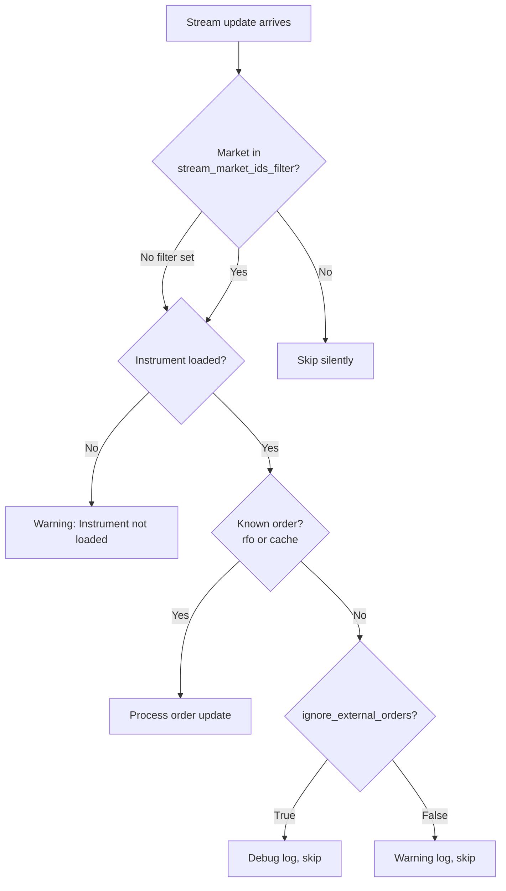

# Betfair
> 本文档为 [English 原文](../../docs/integrations/betfair.md) 的中文翻译版本。如有歧义请以英文原版为准。

Betfair 创立于 2000 年，运营着世界上最大的在线博彩交易所，总部位于伦敦，并在全球设有分支机构。

NautilusTrader 提供了与 Betfair REST API 和 Exchange Streaming API 集成的适配器。

## 安装

安装带有 Betfair 支持的 NautilusTrader：

```bash
uv pip install "nautilus_trader[betfair]"
```

从源码构建并包含 Betfair extras：

```bash
uv sync --all-extras
```

## 示例

实时示例脚本可在 [此处](https://github.com/nautechsystems/nautilus_trader/tree/develop/examples/live/betfair/) 找到。

## Betfair 文档

Betfair 为开发者提供以下文档：

- [Betfair 开发者门户](https://developer.betfair.com/)：API 访问和文档的主入口。
- [Exchange API 指南](https://developer.betfair.com/exchange-api/)：Betting、Accounts 和 Streaming API 的概览。

## 应用 Key（Application keys）

Betfair 需要一个 Application Key 来对 API 请求进行认证。在注册并为账户充值后，使用 [API-NG 开发者 AppKeys 工具](https://apps.betfair.com/visualisers/api-ng-account-operations/) 获取你的 key。

每个账户会分配两个 App Key：一个 **Live** key（需要一次性激活费）和一个 **Delayed** key（用于开发和测试）。

:::info
有关详细的设置说明，请参阅 [Application Keys](https://betfair-developer-docs.atlassian.net/wiki/spaces/1smk3cen4v3lu3yomq5qye0ni/pages/2687105/Application+Keys) 文档。
:::

## API 凭据

通过环境变量或客户端配置提供 Betfair 凭据：

```bash
export BETFAIR_USERNAME=<your_username>
export BETFAIR_PASSWORD=<your_password>
export BETFAIR_APP_KEY=<your_app_key>
export BETFAIR_CERTS_DIR=<path_to_certificate_dir>
```

:::tip
我们建议使用环境变量来管理凭据。
:::

:::note
Rust 当前说明：Rust 目前会读取 `BETFAIR_USERNAME`、`BETFAIR_PASSWORD` 和 `BETFAIR_APP_KEY`，但尚未读取 `BETFAIR_CERTS_DIR`。
:::

## SSL 证书

Betfair 推荐自动化交易系统采用使用 SSL 证书的 [非交互式（bot）登录](https://betfair-developer-docs.atlassian.net/wiki/spaces/1smk3cen4v3lu3yomq5qye0ni/pages/2687915/Non-Interactive+bot+login)。`certs_dir` 配置是可选的，但生产部署建议使用证书。

### 生成证书

使用 OpenSSL 创建一个 2048 位的 RSA 证书：

```bash
# 生成私钥和证书签名请求
openssl genrsa -out client-2048.key 2048
openssl req -new -key client-2048.key -out client-2048.csr

# 自签名证书（有效期 365 天）
openssl x509 -req -days 365 -in client-2048.csr -signkey client-2048.key -out client-2048.crt
```

### 上传到 Betfair

在使用证书之前，将其附加到你的 Betfair 账户：

1. 进入 [My Betfair Account Security](https://myaccount.betfair.com/accountdetails/mysecurity?showAPI=1)。
2. 滚动至 **Automated Betting Program Access** 并点击 **Edit**。
3. 上传你的 `client-2048.crt` 文件。

### 目录结构

把证书文件放在某个目录中，并将 `BETFAIR_CERTS_DIR` 设置为该路径：

```
/path/to/certs/
├── client-2048.crt
└── client-2048.key
```

:::info
SSL 证书用于 Exchange Streaming API 连接。REST API 使用用户名/密码加 Application Key 的方式进行认证。
:::

:::warning
在 Betfair 网站上开启两步认证（2FA）不会影响 API 访问。无论是否启用 2FA，基于证书的登录始终有效。
:::

## 概览

Betfair 适配器提供三个主要组件：

- `BetfairInstrumentProvider`：加载 Betfair 市场并将其转换为 Nautilus 标的。
- `BetfairDataClient`：通过 Exchange Streaming API 流式接收实时行情数据。
- `BetfairExecutionClient`：通过 REST API 提交订单（投注）并跟踪执行状态。

## 实现状态

NautilusTrader 目前提供稳定的 Python Betfair 适配器，以及进行中的 Rust 等效路径。

本页面仍是稳定指南，并以行内方式突出说明主要的 Rust 差异。请使用 [Betfair v2 过渡指南](betfair_v2.md) 来了解 `crates/adapters/betfair` 当前的 Rust 优先行为以及计划的切换路径。

## 订单能力

Betfair 作为一个博彩交易所运作，与传统金融交易所相比具有独特的特征：

### 订单类型

| 订单类型               | 是否支持 | 备注                                |
|------------------------|-----------|-------------------------------------|
| `MARKET`               | ✓*        | Python 将常规市价单映射为激进 `LIMIT`；Rust 仅支持 BSP `AT_THE_CLOSE`。 |
| `LIMIT`                | ✓         | 在指定赔率下挂单。     |
| `STOP_MARKET`          | -         | *不支持*。                    |
| `STOP_LIMIT`           | -         | *不支持*。                    |
| `MARKET_IF_TOUCHED`    | -         | *不支持*。                    |
| `LIMIT_IF_TOUCHED`     | -         | *不支持*。                    |
| `TRAILING_STOP_MARKET` | -         | *不支持*。                    |

### 执行指令

| 指令          | 是否支持 | 备注                                |
|---------------|-----------|-------------------------------------|
| `post_only`   | -         | 不适用于博彩交易所。 |
| `reduce_only` | -         | 不适用于博彩交易所。 |

### 有效期选项

| 有效期        | 是否支持 | 备注                                       |
|---------------|-----------|--------------------------------------------|
| `GTC`         | ✓         | 映射到 Betfair 的 `PERSIST` persistence。     |
| `GTD`         | -         | *不支持*。                           |
| `DAY`         | ✓         | 映射到 Betfair 的 `LAPSE` persistence。       |
| `FOK`         | ✓         | 映射到 Betfair 的 `FILL_OR_KILL`。            |
| `IOC`         | ✓         | 映射到 `FILL_OR_KILL`，允许部分成交。 |

:::note
Betfair 使用的是 persistence 模型，而非传统的 time-in-force。适配器将 `FOK` 映射到 Betfair 的 `FILL_OR_KILL`，而 `IOC` 使用 `FILL_OR_KILL` 配合 `min_fill_size=0` 来允许部分成交。

当前适配器也支持 BSP 收盘订单流程。Rust 仅在 `AT_THE_CLOSE` 模式下接受 `MARKET` 订单；Rust 同时也将 `AT_THE_CLOSE` 或 `AT_THE_OPEN` 模式下的 `LIMIT` 订单映射到 Betfair 的 `LIMIT_ON_CLOSE` 指令。
:::

### 高级订单特性

| 特性               | 是否支持 | 备注                                    |
|--------------------|-----------|------------------------------------------|
| 订单修改 | ✓         | 仅限不改变敞口的字段。 |
| 套单/OCO 订单 | -         | *不支持*。                         |
| 冰山订单     | -         | *不支持*。                         |

### 批量操作

| 操作               | 是否支持 | 备注                |
|--------------------|-----------|----------------------|
| 批量提交       | ✓         | Python 和 Rust 均支持 `SubmitOrderList`。 |
| 批量修改       | -         | *不支持*。     |
| 批量取消       | ✓         | Python 和 Rust 均支持批量取消请求。 |

### 持仓管理

| 特性                | 是否支持 | 备注                                   |
|---------------------|-----------|-----------------------------------------|
| 查询持仓     | -         | 博彩交易所模型不同。         |
| 持仓模式       | -         | 不适用于博彩交易所。     |
| 杠杆控制    | -         | 博彩交易所没有杠杆。        |
| 保证金模式         | -         | 博彩交易所没有保证金。          |

### 订单查询

| 特性                 | 是否支持 | 备注                                  |
|----------------------|-----------|----------------------------------------|
| 查询挂单    | ✓         | 列出所有活动的投注。                  |
| 查询订单历史  | ✓         | 历史投注数据。               |
| 订单状态更新 | ✓         | 实时的投注状态变化。           |
| 成交历史        | ✓         | 投注撮合和结算报告。   |

### 条件订单

| 特性                | 是否支持 | 备注                                   |
|---------------------|-----------|-----------------------------------------|
| 订单列表         | -         | *不支持*。                        |
| OCO 订单          | -         | *不支持*。                        |
| 套单（bracket）      | -         | *不支持*。                        |
| 条件订单  | -         | 仅基本投注条件。              |

## 价格刻度方案与定价

Betfair 使用分层的价格刻度方案，不同价格区间使用不同的最小价格变动：

| 价格区间      | 最小价格变动 |
|---------------|-----------|
| 1.01 - 2.00   | 0.01      |
| 2.00 - 3.00   | 0.02      |
| 3.00 - 4.00   | 0.05      |
| 4.00 - 6.00   | 0.10      |
| 6.00 - 10.00  | 0.20      |
| 10.00 - 20.00 | 0.50      |
| 20.00 - 30.00 | 1.00      |
| 30.00 - 50.00 | 2.00      |
| 50.00 - 100.00 | 5.00     |
| 100.00 - 1000.00 | 10.00  |

最低价格为 1.01，最高价格为 1000.00。

## 订单修改

Betfair 上的订单修改有特定的约束：

- **价格和数量不能原子性地一起修改** - 这需要分别操作。
- **修改价格** 使用 `ReplaceOrders`（取消 + 以新价格新建订单）。
- **减少数量** 使用带有 `size_reduction` 参数的 `CancelOrders`。
- **增加数量** 不支持 - 请改为提交新订单。

:::warning
一次替换操作会同时产生原订单的 cancel 事件和新订单的 accepted 事件。适配器跟踪挂起的替换以抑制合成的 cancel 事件。
:::

## 订单流成交处理

执行客户端处理来自 Betfair Exchange Streaming API 的订单更新。有两个配置选项控制如何过滤这些更新：

- **`stream_market_ids_filter`**：在市场层面过滤（早期退出，静默跳过）。
- **`ignore_external_orders`**：在订单层面过滤。Python 还使用它来控制完整镜像缓存检查的日志级别。Rust 目前仅跳过没有 `rfo` 的 OCM 更新。

下面的流程图与稳定版 Python 的执行路径相对应。

Python 把 `stream_market_ids_filter` 与调节范围（`reconcile_market_ids_only`）分开。Rust 目前在 `reconcile_market_ids_only=False` 且未显式配置 `reconcile_market_ids` 时，调节期间会回退到 `stream_market_ids_filter`。



Python 在 `check_cache_against_order_image` 的完整镜像调节过程中也会应用 `stream_market_ids_filter`。Rust 目前通过 `generate_mass_status()` 进行调节，尚未执行同样的完整镜像缓存检查。

当 `ignore_external_orders=True` 时，Python 适配器会跳过缓存中不存在的订单和成交：

| 场景                         | 描述                                         |
|--------------------------------|-----------------------------------------------------|
| 流更新中出现未知订单 | 不存在 venue 到 client 的订单 ID 映射。         |
| 完整镜像中出现未知订单    | 镜像同步期间在缓存中找不到的订单。         |
| 完整镜像中出现未知成交     | 同步期间没有与任何已知订单匹配的成交。    |

:::info
对于共享一个 Betfair 账户的多节点部署，请同时设置 `stream_market_ids_filter`（仅你的市场）和 `ignore_external_orders=True`，以避免出现关于其他节点管理的订单的警告。
:::

### 成交处理

适配器在处理来自 stream 的成交时需要处理多种边界情况：

- **增量成交**：Betfair 报告的是累计撮合数量。适配器通过跟踪每个订单上次的已成交数量来计算增量成交。
- **超额成交保护**：超过订单数量的成交会被拒绝。
- **去重**：已发布 trade ID 的缓存可防止由延迟消息或 stream 重连回放引起的重复成交事件。
- **竞态条件**：当流成交先于 HTTP 订单响应到达时，适配器会立即缓存场所订单 ID，以确保正确匹配订单。
- **网络错误恢复**：当 HTTP 订单提交因网络错误（超时、连接重置）失败时，订单可能已经下到场所。适配器会让订单保持在 SUBMITTED 状态，并保留 customer order reference，以便 stream 重新连接后确认该订单。如果是 API 错误（即 Betfair 明确拒绝），则会立即拒绝。

## 限流

适配器使用独立的限流 bucket，使账户状态轮询和调节操作不会限制下单速率：

| Bucket  | 默认值  | 端点                                            | 是否可配置                       |
|---------|---------|------------------------------------------------------|----------------------------------|
| General | 5/s     | 账户状态、调节、keep‑alive。           |                                  |
| Orders  | 20/s    | `placeOrders`、`replaceOrders`、`cancelOrders`。      | `order_request_rate_per_second`。 |

订单状态和成交报告查询遇到 `TOO_MANY_REQUESTS` 错误时，会在延迟 1 秒后重试一次；订单操作则会以错误信息直接拒绝。

Betfair 实际的 API 限制更加细致：

| 类别                     | 限制                  | 备注                                                |
|--------------------------|----------------------|------------------------------------------------------|
| 订单操作          | 1,000 笔/秒 | `placeOrders`、`cancelOrders`、`replaceOrders` 的总指令数。 |
| 订单查询投影 | 3 个并发        | `listMarketBook`（带 `OrderProjection`）、`listCurrentOrders`、`listMarketProfitAndLoss`。 |
| 最佳实践            | 5 请求/秒        | 单个市场的 `listMarketBook` 建议值。         |

:::info
有关限流的详细信息，请参阅 [Why am I receiving the TOO_MANY_REQUESTS error?](https://support.developer.betfair.com/hc/en-us/articles/360000406111) 以及 [Market Data Request Limits](https://docs.developer.betfair.com/display/1smk3cen4v3lu3yomq5qye0ni/Market+Data+Request+Limits)。
:::

## 自定义数据类型

Betfair 适配器提供多个自定义数据类型，这些数据通过市场 stream 流入。所有自定义数据在订阅市场时会自动传递 —— 无需显式订阅，不过策略可以为特定数据类型注册处理器。

### BetfairTicker

某个投注选项的实时 ticker 数据。

| 字段                  | 类型    | 描述                     |
|-----------------------|---------|---------------------------------|
| `instrument_id`       | str     | Nautilus 标的标识符。 |
| `last_traded_price`   | float   | 最近撮合价格（赔率）。      |
| `traded_volume`       | float   | 总撮合量。           |
| `starting_price_near` | float   | 近端 BSP 指标。        |
| `starting_price_far`  | float   | 远端 BSP 指标。         |

### BetfairStartingPrice

市场收盘后实现的 Betfair Starting Price (BSP)。

| 字段            | 类型  | 描述                     |
|-----------------|-------|---------------------------------|
| `instrument_id` | str   | Nautilus 标的标识符。 |
| `bsp`           | float | 最终起步价（赔率）。    |

### BetfairRaceRunnerData

每匹赛马的实时 GPS 跟踪数据（Total Performance Data）。仅在支持的英国和爱尔兰赛马中可用。

| 字段               | 类型  | 描述                             |
|--------------------|-------|-----------------------------------------|
| `race_id`          | str   | Betfair 比赛标识符。                |
| `market_id`        | str   | Betfair 市场标识符。              |
| `selection_id`     | int   | Betfair 选项（赛马）标识符。  |
| `latitude`         | float | GPS 纬度。                           |
| `longitude`        | float | GPS 经度。                          |
| `speed`            | float | 当前速度（m/s，多普勒推导）。 |
| `progress`         | float | 距终点线的距离（米）。      |
| `stride_frequency` | float | 步频（Hz）。                 |

### BetfairRaceProgress

比赛汇总数据，包含分段时间和当前排名顺序。

| 字段             | 类型       | 描述                                   |
|------------------|------------|-----------------------------------------------|
| `race_id`        | str        | Betfair 比赛标识符。                      |
| `market_id`      | str        | Betfair 市场标识符。                    |
| `gate_name`      | str        | 计时门（例如 "1f"、"2f"、"Finish"）。     |
| `sectional_time` | float      | 该分段的耗时（秒）。             |
| `running_time`   | float      | 自比赛开始的总耗时（秒）。       |
| `speed`          | float      | 领先马的速度（m/s）。                      |
| `progress`       | float      | 领先马距终点的距离（米）。      |
| `order`          | list[int]  | 按当前比赛位置排序的选项 ID 列表。 |
| `jumps`          | list[dict] | 国家越野赛障碍数据。   |

### 订阅自定义数据

当你订阅市场时，自定义数据会自动通过 Betfair 市场 stream 流入。要在策略或 actor 中接收自定义数据，请使用 Betfair client ID 注册一个 handler：

```python
from nautilus_trader.adapters.betfair.constants import BETFAIR_CLIENT_ID
from nautilus_trader.adapters.betfair.data_types import BetfairRaceRunnerData
from nautilus_trader.adapters.betfair.data_types import BetfairRaceProgress
from nautilus_trader.adapters.betfair.data_types import BetfairTicker
from nautilus_trader.model.data import DataType

class MyStrategy(Strategy):
    def on_start(self):
        # Subscribe to ticker data
        self.subscribe_data(DataType(BetfairTicker), client_id=BETFAIR_CLIENT_ID)

        # Subscribe to ALL race runner data (wildcard)
        self.subscribe_data(DataType(BetfairRaceRunnerData), client_id=BETFAIR_CLIENT_ID)

        # Or subscribe to a specific runner by selection_id
        self.subscribe_data(
            DataType(BetfairRaceRunnerData, metadata={"selection_id": 49411491}),
            client_id=BETFAIR_CLIENT_ID,
        )

        # Subscribe to ALL race progress updates (wildcard)
        self.subscribe_data(DataType(BetfairRaceProgress), client_id=BETFAIR_CLIENT_ID)

        # Or subscribe to a specific race by race_id
        self.subscribe_data(
            DataType(BetfairRaceProgress, metadata={"race_id": "35278018.1617"}),
            client_id=BETFAIR_CLIENT_ID,
        )

    def on_data(self, data):
        if isinstance(data, BetfairRaceRunnerData):
            self.log.info(
                f"Runner {data.selection_id}: speed={data.speed} m/s, "
                f"progress={data.progress}m to finish"
            )
        elif isinstance(data, BetfairRaceProgress):
            self.log.info(f"Race order: {data.order}")
        elif isinstance(data, BetfairTicker):
            self.log.info(f"LTP: {data.last_traded_price}")
```

:::info
使用 `DataType(BetfairRaceRunnerData)`（不带 metadata）进行订阅可接收 **所有** 选手的数据。添加 `metadata={"selection_id": <id>}` 可过滤到特定选手。类似地，`DataType(BetfairRaceProgress)` 接收所有比赛的进度，而 `metadata={"race_id": <id>}` 过滤到指定的比赛。

赛事数据（RCM 消息）需要 Total Performance Data (TPD) 覆盖以及具有 TPD 访问权限的 Betfair API key。并非所有比赛都启用了 GPS 跟踪。
:::

### 从文件加载赛事数据

为了使用录制的赛事数据进行回测，可以使用文件解析器：

```python
from nautilus_trader.adapters.betfair.parsing.core import parse_betfair_rcm_file

for data in parse_betfair_rcm_file("path/to/rcm_data.json"):
    if isinstance(data, BetfairRaceRunnerData):
        print(f"Runner {data.selection_id} at {data.latitude}, {data.longitude}")
```

## 配置

### 数据客户端配置选项

| 选项                      | 默认值    | 说明 |
|---------------------------|-----------|-------------|
| `account_currency`        | 必填  | 数据和价格行情使用的 Betfair 账户币种。 |
| `username`                | `None`    | Betfair 账户用户名；省略时从环境变量读取。 |
| `password`                | `None`    | Betfair 账户密码；省略时从环境变量读取。 |
| `app_key`                 | `None`    | 用于 API 认证的 Betfair Application Key。 |
| `certs_dir`               | `None`    | 包含 Betfair SSL 证书的目录，用于登录。 |
| `instrument_config`       | `None`    | 可选的 `BetfairInstrumentProviderConfig`，用于限定可用市场范围。 |
| `subscription_delay_secs` | `3`       | 发送初始市场订阅请求之前的延迟（秒）。 |
| `keep_alive_secs`         | `36,000`  | Betfair session 的 keep‑alive 间隔（秒）。 |
| `subscribe_race_data`     | `False`   | 为 `True` 时，订阅 Race Change Messages (RCM) 以获取实时 GPS 跟踪数据。 |
| `stream_conflate_ms`      | `None`    | 显式的 stream 合并间隔（毫秒，`0` 表示禁用合并）。 |
| `stream_heartbeat_ms`     | `5,000`    | stream 心跳间隔（毫秒，500-5000）。`None` 表示省略。 |
| `proxy_url`               | `None`    | 用于 HTTP 请求的可选代理 URL。 |

:::warning
当 `stream_conflate_ms` 为 `None` 时，Betfair 会应用其默认合并行为（通常启用）。请显式设置 `stream_conflate_ms=0` 以确保不进行合并，并接收每一次价格更新。
:::

:::note
当前 Rust 差异：

- Rust 尚未公开 `certs_dir`。
- Rust 不使用 `instrument_config`，而是通过 `BetfairDataConfig` 上的直接过滤字段来限定标的范围。
- Rust 使用固定的 36,000 秒 keep-alive 间隔。
- Rust 当前要求必须提供 `stream_heartbeat_ms`，不接受 `None` 以省略心跳。

:::

### 执行客户端配置选项

| 选项                         | 默认值   | 说明 |
|------------------------------|----------|-------------|
| `account_currency`           | 必填 | 用于下单和余额的 Betfair 账户币种。 |
| `username`                   | `None`   | Betfair 账户用户名；省略时从环境变量读取。 |
| `password`                   | `None`   | Betfair 账户密码；省略时从环境变量读取。 |
| `app_key`                    | `None`   | 用于 API 认证的 Betfair Application Key。 |
| `certs_dir`                  | `None`   | 包含 Betfair SSL 证书的目录，用于登录。 |
| `instrument_config`          | `None`   | 可选的 `BetfairInstrumentProviderConfig`，用于限定调节范围。 |
| `calculate_account_state`    | `True`   | 为 `True` 时，根据事件本地计算账户状态。 |
| `request_account_state_secs` | `300`    | 轮询 Betfair 获取账户状态的间隔（秒，`0` 表示禁用）。 |
| `reconcile_market_ids_only`  | `False`  | 为 `True` 时，调节仅覆盖 `instrument_config.market_ids`（如未设置则无效）。 |
| `reconcile_market_ids`       | `None`   | 仅 Rust。当 `reconcile_market_ids_only=True` 时用于调节的显式 market IDs。 |
| `stream_market_ids_filter`   | `None`   | 从 stream 中处理的 market IDs 列表；其他被静默跳过。 |
| `ignore_external_orders`     | `False`  | 为 `True` 时，忽略本地缓存中不存在的 stream 订单。 |
| `use_market_version`         | `False`  | 为 `True` 时，将最新的 market version 附加到订单请求中以进行价格保护。 |
| `order_request_rate_per_second` | `20`  | 订单端点的限流（请求/秒），与通用 API 端点分开。 |
| `stream_heartbeat_ms`        | `5,000`   | 订单 stream 的心跳间隔（毫秒，500-5000）。`None` 表示省略。 |
| `proxy_url`                  | `None`   | 用于 HTTP 请求的可选代理 URL。 |

:::warning
如果你设置了 `stream_market_ids_filter`，请确保它包含你交易的所有市场。在该过滤器排除之外的市场上下的订单，会错过来自 stream 的实时成交和取消更新。
:::

:::note
当前 Rust 差异：

- Rust 尚未公开 `certs_dir` 或 `instrument_config`。
- Rust 把 `calculate_account_state` 作为周期性账户状态轮询的开关。
- 当 `reconcile_market_ids_only=True` 时，Rust 使用 `reconcile_market_ids`。
- 如果 `reconcile_market_ids_only=False`，并且未设置 `reconcile_market_ids`，Rust 启动时的调节当前会回退到 `stream_market_ids_filter`。
- Rust 目前仅对没有 `rfo` 的 OCM 更新应用 `ignore_external_orders`。
- Rust 当前要求必须提供 `stream_heartbeat_ms`，不接受 `None` 以省略心跳。

:::

## Session 管理

Betfair session 通常每 12-24 小时过期一次。当发生 `NO_SESSION` 或 `INVALID_SESSION_INFORMATION` 错误时，适配器会自动处理 session 重连：

- HTTP 客户端重新连接并获取新的 session token。
- 流客户端重新认证并重新订阅市场。
- keep-alive 机制主动延长 session。Python 暴露 `keep_alive_secs`，Rust 当前使用固定的 10 小时间隔。

:::info
账户状态轮询或 keep-alive 期间出现的 session 错误会触发自动重连。正常的 session 过期无需手动干预。
:::

## 市场版本价格保护

Betfair 市场拥有一个 `version` 编号，每当市场账本发生变化（例如出现新价格层级、或某笔投注被撮合）时递增。适配器可以把这个 version 附加到 `placeOrders` 和 `replaceOrders` 请求中，从而对陈旧订单提供价格保护。

当 `use_market_version=True` 时，每个订单请求都会包含适配器最近看到的 market version。如果 Betfair 处理订单时市场已经超过了那个 version，Betfair 会让该投注 **lapse**（失效），而不是让它在变更后的账本上撮合。

```python
from nautilus_trader.adapters.betfair.config import BetfairExecClientConfig

exec_config = BetfairExecClientConfig(
    account_currency="GBP",
    use_market_version=True,
)
```

适配器从标的的 `info` 字典中读取 market version，该字典由 Exchange Streaming API 的 `MarketDefinition` 更新填充。这意味着：

- 该 version 反映的是最近一次 stream 更新，而不是 HTTP API 快照。
- 市场变化与适配器收到更新后的 version 之间存在固有的延迟。
- 在收到第一个 stream `MarketDefinition` 之前提交的订单不会包含 version。

:::warning
市场版本保护是保守的。在快速变化的市场中，从你的下单信号到提交期间 version 可能会更新，导致即使价格仍可接受，投注也会失效。请权衡这种保护与成交率之间的取舍。
:::

## 多节点部署

当多个交易节点共享同一个 Betfair 账户但分别交易不同的市场时，请按如下方式配置每个节点，以避免相互干扰：

1. 将 `stream_market_ids_filter` 设置为仅包含该节点交易的市场。
2. 设置 `ignore_external_orders=True` 以抑制关于其他节点订单的警告。
3. 设置 `reconcile_market_ids_only=True` 来限制调节范围。

这样可避免警告刷屏，并确保每个节点仅处理自己的订单和成交。

下面是一个最小示例，展示如何使用 Betfair 客户端配置实时 `TradingNode`：

```python
from nautilus_trader.adapters.betfair import BETFAIR
from nautilus_trader.adapters.betfair import BetfairLiveDataClientFactory
from nautilus_trader.adapters.betfair import BetfairLiveExecClientFactory
from nautilus_trader.config import TradingNodeConfig
from nautilus_trader.live.node import TradingNode

# Configure Betfair data and execution clients (using AUD account currency)
config = TradingNodeConfig(
    data_clients={BETFAIR: {"account_currency": "AUD"}},
    exec_clients={BETFAIR: {"account_currency": "AUD"}},
)

# Build the TradingNode with Betfair adapter factories
node = TradingNode(config)
node.add_data_client_factory(BETFAIR, BetfairLiveDataClientFactory)
node.add_exec_client_factory(BETFAIR, BetfairLiveExecClientFactory)
node.build()
```

## 贡献

:::info
如需添加更多功能或为 Betfair 适配器做出贡献，请参阅我们的
[贡献指南](https://github.com/nautechsystems/nautilus_trader/blob/develop/CONTRIBUTING.md)。
:::
