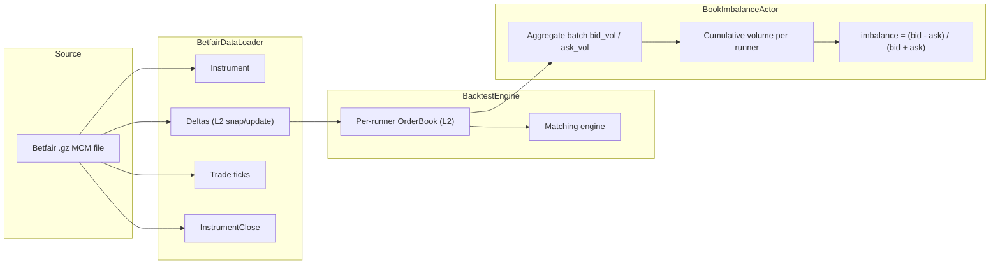

# 订单簿失衡回测（Betfair）

> 本文档为 [English 原文](../../docs/tutorials/backtest_book_imbalance_betfair.md) 的中文翻译版本。如有歧义请以英文原版为准。

:::note
这是一篇 **纯 Rust** 的 v2 系统教程。它直接驱动 Rust 的 `BacktestEngine`，
使用 Betfair 原始流数据，绕过了 Python 与 Parquet 路径。
:::

本教程在 Betfair 的 MATCH_ODDS 市场上回测一个 `BookImbalanceActor`。
它加载一份原始的历史流式 `.gz` 文件，喂给 Rust `BacktestEngine`，
并按 runner 跟踪买卖双方报价量的失衡情况。

## 简介

Betfair 是一家体育博彩交易所，参与者以小数赔率（decimal odds）对结果进行
back（买入，bid）和 lay（卖出，ask）。每个 runner 都拥有独立的 L2 订单簿，
其行为与金融订单簿类似。

该 Actor 读取每个 runner 的 `OrderBookDeltas`，并按方向累积两个运行总量：
买入量（back orders）和卖出量（lay orders）。每个批次以及累计的失衡（imbalance）
计算公式如下：

```
imbalance = (bid_volume - ask_volume) / (bid_volume + ask_volume)
```

正值表示市场倾向于看好（back）该结果。
体育交易员常把它作为起点信号，通常会结合价格动量或市场层面的特征使用。

release 模式下，配合撮合引擎的完整订单簿维护，处理速度大约为每秒三百万个数据点。



## 前置条件

- 一套可用的 Rust 工具链（[rustup.rs](https://rustup.rs)）。
- 已克隆并能构建 NautilusTrader 仓库。
- 一份 Betfair 历史 `.gz` 文件，包含 MCM（Market Change Message）数据。
  可从 [Betfair 历史数据](https://historicdata.betfair.com/)、第三方归档，
  或者你自行录制的 Exchange Streaming API 获取。

将文件放置在：

```
tests/test_data/local/betfair/1.253378068.gz
```

该路径已被 gitignore 忽略，不随仓库分发。内置的示例数据集是一个足球 MATCH_ODDS 市场，
包含 3 个 runner，约 82,000 行 MCM，录制时长 18 天。

## 加载数据

`BetfairDataLoader` 读取 gzip 压缩的 Betfair Exchange Streaming API 文件，
并将每一行解析为 Nautilus 领域对象：

```rust
use nautilus_betfair::loader::{BetfairDataItem, BetfairDataLoader};
use nautilus_model::types::Currency;

let mut loader = BetfairDataLoader::new(Currency::GBP(), None);
let items = loader.load(&filepath)?;
```

loader 返回 `Vec<BetfairDataItem>`：

| 变体                | 描述                                              | 映射到 `Data` 枚举？       |
|:--------------------|:--------------------------------------------------|:---------------------------|
| `Instrument`        | 来自市场定义的 runner 定义。                      | 否（单独添加）             |
| `Status`            | 市场状态切换（PreOpen、Trading 等）。             | 否（`Data` 无对应变体）    |
| `Deltas`            | 订单簿快照或增量（delta）更新。                   | 是，`Data::Deltas`         |
| `Trade`             | 由累计成交量推导出的增量成交 Tick。               | 是，`Data::Trade`          |
| `Ticker`            | 最新成交价、成交量、BSP near/far。                | -                          |
| `StartingPrice`     | runner 的 Betfair Starting Price。                | -                          |
| `BspBookDelta`      | BSP 专属的订单簿增量。                            | -                          |
| `InstrumentClose`   | 结算事件。                                        | 是，`Data::InstrumentClose`|
| `SequenceCompleted` | 批次完成标记。                                    | -                          |
| `RaceRunnerData`    | GPS 跟踪数据（赛马 / 灵缇犬比赛）。               | -                          |
| `RaceProgress`      | 比赛层面的进度数据。                              | -                          |

回测引擎接收 `Data` 枚举，因此我们映射需要的变体，跳过 Betfair 专属类型：

```rust
use nautilus_model::data::{Data, OrderBookDeltas_API};

let mut instruments = AHashMap::new();
let mut data: Vec<Data> = Vec::new();

for item in items {
    match item {
        BetfairDataItem::Instrument(inst) => {
            instruments.insert(inst.id(), *inst);
        }
        BetfairDataItem::Deltas(d) => {
            data.push(Data::Deltas(OrderBookDeltas_API::new(d)));
        }
        BetfairDataItem::Trade(t) => {
            data.push(Data::Trade(t));
        }
        BetfairDataItem::InstrumentClose(c) => {
            data.push(Data::InstrumentClose(c));
        }
        _ => {}
    }
}
```

`OrderBookDeltas_API` 是对 `OrderBookDeltas` 的薄包装器（FFI），由 `Data` 枚举所需。

由于每次市场定义更新都会重新触发 instrument，因此通过 map 按最新版本去重。

:::warning
`Status` 变体携带市场状态切换信息（PreOpen、Trading、Suspended、Closed），
但 `Data` 枚举对此没有对应变体。本示例不重放状态切换。
如果你将其扩展为一个会下单的策略，撮合引擎将看不到流中包含的市场暂停或收盘信息。
请单独订阅 instrument status，或在引擎中加入 status 路由。
:::

## Actor

NautilusTrader 在 trading crate 的 examples 模块中提供了 `BookImbalanceActor`。
示例代码中按 runner 提供 instrument 列表并指定日志间隔：

```rust
use nautilus_trading::examples::actors::BookImbalanceActor;

let actor = BookImbalanceActor::new(instrument_ids, 5000, None);
engine.add_actor(actor)?;
```

第二个参数是日志间隔：每个 runner 每 5,000 次更新打印一行进度。
示例从环境变量读取 `IMBALANCE_LOG_INTERVAL`，
如果你希望在教程末尾的面板中捕获更细粒度的数据，请将其设置为较小的值（如 `200`）。

完整源码位于
[`crates/trading/src/examples/actors/imbalance/actor.rs`](https://github.com/nautechsystems/nautilus_trader/tree/develop/crates/trading/src/examples/actors/imbalance/actor.rs)。

### 工作原理

Rust 中一个 `DataActor` 需要三块内容：

1. 一个包含 `DataActorCore` 字段以及自身状态的结构体。
2. 使用 `nautilus_actor!(YourType)` 完成核心接线，并提供 `Debug` 实现。
3. 实现 `DataActor` trait 及其回调。

框架为任何实现了 `DataActor + Debug` 的类型提供了通用的 `Actor` 与 `Component`
实现，因此你无需手动实现它们。

启动时，Actor 会为每个 instrument 订阅 `OrderBookDeltas`。
每次收到更新时，从各个 delta 中按方向汇总成交量，并累加到运行总量中。
停止时，按 instrument 打印汇总信息。

在 `subscribe_book_deltas` 中设置 `managed: false`，意味着 data engine
不会在 cache 中为 Actor 单独维护一份订单簿副本。
交易所端的撮合引擎仍会在每个 delta 上通过 `book.apply_delta()` 维护自己的订单簿。
如果你的 Actor 需要从 `self.cache().order_book(&instrument_id)` 读取完整的订单簿状态，
请设置 `managed: true`。

## 回测引擎配置

### 创建引擎与场所（venue）

Betfair 是一家现金结算的博彩交易所。其 venue 使用
`AccountType::Cash`、`OmsType::Netting` 与 `BookType::L2_MBP`：

```rust
let mut engine = BacktestEngine::new(BacktestEngineConfig::default())?;

engine.add_venue(
    SimulatedVenueConfig::builder()
        .venue(Venue::from("BETFAIR"))
        .oms_type(OmsType::Netting)
        .account_type(AccountType::Cash)
        .book_type(BookType::L2_MBP)
        .starting_balances(vec![Money::from("1_000_000 GBP")])
        .build(),
)?;
```

### 添加 instrument、actor 与数据

```rust
for instrument in instruments.values() {
    engine.add_instrument(instrument)?;
}

let actor = BookImbalanceActor::new(instrument_ids, 5000, None);
engine.add_actor(actor)?;

engine.add_data(data, None, true, true)?;
```

`add_data` 参数依次为 `(data, client_id, validate, sort)`。
当 `validate: true` 时，引擎会检查第一个元素的 instrument 是否已注册
（假定整批数据是同质的）。当 `sort: true` 时，会按时间戳排序。

### 运行

```rust
engine.run(None, None, None, false)?;
```

四个参数依次为 `(start, end, run_config_id, streaming)`。
将 start/end 传入 `None`，则使用所加载数据的完整时间范围。

## 运行过程中发生了什么

引擎按时间戳顺序处理每个数据点：

1. 将时钟推进到该数据的时间戳。
2. 将数据路由到模拟交易所，交易所对该 instrument 的 `OrderBook`
   逐条应用 delta，并执行撮合引擎周期。
3. 通过 data engine 与消息总线发布数据，从而触发 Actor 的
   `on_book_deltas` 回调。
4. 排空命令队列并结算 venue（处理任何待处理的订单）。

撮合引擎为每个 instrument 维护一份完整订单簿。本示例没有需要撮合的订单，
因此一旦把它换成 `Strategy`，订单簿状态就立刻可用。

## 结果

内置的 MATCH_ODDS 数据集包含三个 runner、143,098 个数据点；
release 构建大约 48 ms 完成运行：

```
--- Book imbalance summary ---
  1.253378068-2426.BETFAIR   updates: 53197  bid_vol: 212225339.34  ask_vol: 117422531.85  imbalance:  0.2876
  1.253378068-48783.BETFAIR  updates: 36475  bid_vol:  52506905.49  ask_vol:  19104694.72  imbalance:  0.4664
  1.253378068-58805.BETFAIR  updates: 25426  bid_vol:  24295351.82  ask_vol:  25692733.11  imbalance: -0.0280
```

Runner `2426`（最终的获胜者，结算 BSP 为 2.22）以 +0.288 结束：
back 流在整个市场中始终主导 lay 流。Runner `48783` 在更少的更新次数下
显示了更强的 back 压力（+0.466），而 `58805` 接近中性（-0.028）。


**图 1.** *每个 runner 在整个市场生命周期约 14.3 万次更新中的累计
`(bid - ask) / (bid + ask)`。虚线标记各 runner 的最终 imbalance。*


**图 2.** *每个 runner 在 `IMBALANCE_LOG_INTERVAL=200` 批次上的
有符号流比 `(bid - ask) / (bid + ask)` 分布。每个 runner 批次分布的形状
比累计 imbalance 更具信号强度。*


**图 3.** *每个 runner 的累计 back（bid）与 lay（ask）量。
两侧都呈非单调变化：即便累计 imbalance 保持为正，lay 流仍可能在短时间内
超过 back 流。*

### 重新生成面板

Actor 在每隔 N 次更新时记录 `[runner] update #N: batch bid=B ask=A cumulative imbalance=I`。
渲染脚本解析这些日志，并使用 `nautilus_dark` tearsheet 主题生成静态 PNG。

```bash
IMBALANCE_LOG_INTERVAL=200 cargo run -p nautilus-betfair --features examples --release \
    --example betfair-backtest > /tmp/betfair.log 2>&1

uv sync --extra visualization
BETFAIR_LOG=/tmp/betfair.log \
    python3 docs/tutorials/assets/backtest_book_imbalance_betfair/render_panels.py
```

## 运行示例

```bash
# Debug 构建
cargo run -p nautilus-betfair --features examples --example betfair-backtest

# Release 构建（推荐）
cargo run -p nautilus-betfair --features examples --release --example betfair-backtest

# 使用自定义数据文件
cargo run -p nautilus-betfair --features examples --release --example betfair-backtest -- path/to/file.gz
```

## 完整源码

完整示例位于
[`crates/adapters/betfair/examples/betfair_backtest.rs`](https://github.com/nautechsystems/nautilus_trader/tree/develop/crates/adapters/betfair/examples/betfair_backtest.rs)。

## 下一步

- **添加策略**。将 Actor 替换为基于 imbalance 信号下达 back/lay 订单的 `Strategy` 实现。
  范式可参考 `crates/trading/src/examples/strategies/ema_cross/strategy.rs` 中的
  `EmaCross` 示例。
- **使用 managed 订单簿**。在 `subscribe_book_deltas` 中设置 `managed: true`，
  通过 `self.cache().order_book(&id)` 读取完整订单簿，
  以获取更丰富的信号，例如最优盘口价差、深度比、加权中价等。
- **多市场**。加载多个 `.gz` 文件并通过同一个引擎运行，
  以测试跨市场信号。
- **与 Python 对比**。使用 `BacktestEngine` 的 Python API 运行相同的回测。
  Rust 引擎处理同一数据管线的吞吐量大约是 Python/Cython 路径的 6 倍。
