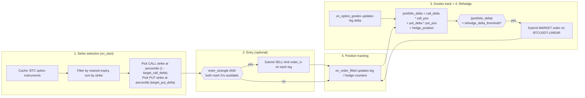

# Delta 中性期权策略（Bybit）

> 本文档为 [English 原文](../../docs/tutorials/delta_neutral_options_bybit.md) 的中文翻译版本。如有歧义请以英文原版为准。

:::note
这是一篇 **纯 Rust** 的 v2 系统教程。它通过 Rust 的 `LiveNode`
在 Bybit 上运行实盘 Delta 中性的卖出波动率策略。
:::

本教程在 Bybit 的 BTC 期权上做一个虚值（OTM）的卖出宽跨式（short strangle）组合，
并使用 BTCUSDT 永续合约进行 delta 对冲。
策略在启动时选择看涨和看跌的执行价，通过基于隐含波动率的限价单入场，
根据交易所提供的希腊字母追踪组合 delta，
当 delta 偏离阈值时在永续合约上提交市价对冲订单。

:::warning
该策略在主网上以真实资金进行交易。设置 `enter_strangle: false`
仅仅会禁用初始的 strangle 入场订单。策略在启动时仍会从 cache 中重建已有持仓，
当组合 delta 突破阈值时，依然会在永续合约上提交对冲订单。
如果账户中存在前一会话遗留的期权或对冲持仓，策略仍会继续交易。
:::

## 前置条件

- 完成 [期权数据教程](options_data_bybit.md)，
  其中覆盖了 instrument 发现、希腊字母订阅以及 `DataActor` 模式。
- 一个具备 **交易权限** 的 Bybit API key，权限范围包括期权与线性永续合约。
- 环境变量：

```bash
export BYBIT_API_KEY="your-api-key"
export BYBIT_API_SECRET="your-api-secret"
```

## 策略概览

`DeltaNeutralVol` 策略位于 trading crate 的 `examples` 模块中，分为五个阶段运行：

1. **执行价选择**：查询 instrument cache 中所有 BTC 期权，
   过滤出最近到期日，按百分位排名选择 OTM 看涨与看跌执行价。
2. **入场**：通过 Bybit 的 `order_iv` 参数，基于隐含波动率在两条腿上下达 SELL 限价单。
   入场是可选的，示例中默认禁用。
3. **希腊字母追踪**：对两条腿订阅 `OptionGreeks`。
   delta 与 IV 直接来自 Bybit 的期权 ticker 流。
4. **再对冲（rehedge）**：计算组合 delta，
   一旦突破阈值就在 BTCUSDT 永续合约上提交市价单。
   每次希腊字母更新以及周期性安全定时器都会触发判断。
5. **持仓跟踪**：通过 `on_order_filled` 追踪看涨、看跌和对冲持仓。
   启动时从 cache 中重建已有持仓。



### 组合 delta

策略将净敞口计算为：

```
portfolio_delta = call_delta * call_position
                + put_delta * put_position
                + hedge_position
```

short strangle 在入场时接近 delta 中性，因为看涨和看跌的 delta 相互抵消。
在默认值 `target_call_delta = 0.20` 与 `target_put_delta = -0.20` 下，
两条腿入场时相互抵消。随着标的的波动，净 delta 会偏离，
策略通过对冲让它回归零附近。

## 配置

示例文件位于
[`crates/adapters/bybit/examples/node_delta_neutral.rs`](https://github.com/nautechsystems/nautilus_trader/tree/develop/crates/adapters/bybit/examples/node_delta_neutral.rs)，
配置策略如下：

```rust
let hedge_instrument_id = InstrumentId::from("BTCUSDT-LINEAR.BYBIT");

let strategy_config =
    DeltaNeutralVolConfig::new("BTC".to_string(), hedge_instrument_id, client_id)
        .with_contracts(1)
        .with_rehedge_delta_threshold(0.5)
        .with_rehedge_interval_secs(30)
        .with_enter_strangle(false)
        .with_iv_param_key("order_iv".to_string());

let strategy = DeltaNeutralVol::new(strategy_config);
```

参数说明（默认值为结构体的默认值；示例将 `enter_strangle` 覆盖为 `false`，
将 `iv_param_key` 覆盖为 `"order_iv"`）：

| 参数                      | 默认值     | 示例值           | 描述                                          |
|---------------------------|------------|------------------|-----------------------------------------------|
| `option_family`           | 必填       | `"BTC"`          | instrument 发现使用的标的过滤器。             |
| `hedge_instrument_id`     | 必填       | `BTCUSDT-LINEAR` | 用于 delta 对冲的永续合约。                   |
| `client_id`               | 必填       | `"BYBIT"`        | 数据与执行客户端标识符。                      |
| `target_call_delta`       | `0.20`     | -                | 选择看涨执行价时的目标 delta。                |
| `target_put_delta`        | `-0.20`    | -                | 选择看跌执行价时的目标 delta。                |
| `contracts`               | `1`        | -                | 每条腿的合约数量。                            |
| `rehedge_delta_threshold` | `0.5`      | -                | 触发对冲的组合 delta 阈值。                   |
| `rehedge_interval_secs`   | `30`       | -                | 周期性再对冲定时器的间隔。                    |
| `enter_strangle`          | `true`     | `false`          | 收到 Greeks 后是否下达入场订单。              |
| `entry_iv_offset`         | `0.0`      | -                | 入场定价低于 mark IV 的 vol 点数。            |
| `iv_param_key`            | `"px_vol"` | `"order_iv"`     | 适配器专属的 IV 参数键。                      |

不同 venue 之间的关键差异是 `iv_param_key`。Bybit 使用 `order_iv`，
适配器将其映射到下单 API 的 `orderIv` 字段。OKX 使用 `px_vol`。
基于 IV 的下单需要正确设置该参数。

## Node 配置

示例同时配置了 `Option` 与 `Linear` 两种产品类型的数据和执行客户端：

```rust
let data_config = BybitDataClientConfig {
    api_key: None,
    api_secret: None,
    product_types: vec![BybitProductType::Option, BybitProductType::Linear],
    ..Default::default()
};

let exec_config = BybitExecClientConfig {
    api_key: None,
    api_secret: None,
    product_types: vec![BybitProductType::Option, BybitProductType::Linear],
    account_id: Some(account_id),
    ..Default::default()
};
```

两种产品类型都需要：`Option` 用于 strangle 的两条腿，`Linear` 用于
BTCUSDT 永续对冲 instrument。执行客户端需要 `account_id` 来追踪订单身份。

```rust
let mut node = LiveNode::builder(trader_id, environment)?
    .with_name("BYBIT-DELTA-NEUTRAL-001".to_string())
    .add_data_client(None, Box::new(data_factory), Box::new(data_config))?
    .add_exec_client(None, Box::new(exec_factory), Box::new(exec_config))?
    .with_reconciliation(true)
    .with_delay_post_stop_secs(5)
    .build()?;

node.add_strategy(strategy)?;
node.run().await?;
```

`with_reconciliation(true)` 会在启动时向 Bybit 查询开放订单与持仓，
在策略启动前重建 cache。这样策略就能延续上一会话遗留的任意持仓。

## 策略工作原理

### 执行价选择

启动时，策略在 cache 中查询所有匹配 `option_family` 的期权 instrument。
丢弃已到期的期权，选择最近到期日，分离看涨与看跌，并按执行价排序。

执行价按排序列表的百分位选择：

- **看涨**：index = `(1.0 - target_call_delta) * count`。
  当目标 delta 为 0.20 且有 50 个看涨期权时，选择第 40 个执行价
  （第 80 百分位，OTM）。
- **看跌**：index = `|target_put_delta| * count`。
  当目标 delta 为 -0.20 时，选择第 10 个执行价（第 20 百分位，OTM）。

这是一个启发式做法。同一到期日下，执行价的排序近似对应 delta 的排序。
生产级别的策略会先订阅所有执行价的希腊字母，再按实际 delta 选择。

### 基于隐含波动率入场

当 `enter_strangle` 为 `true` 且两条腿的 mark IV 都已到达时，
策略使用 `order_iv` 参数下达 SELL 限价单：

```rust
let mut call_params = Params::new();
call_params.insert("order_iv".to_string(), json!(call_entry_iv.to_string()));

self.submit_order(call_order, None, Some(client_id), Some(call_params))?;
```

Bybit 会在服务端将 `orderIv` 转换为限价，
并使其优先级高于任何显式指定的价格。
配置项 `entry_iv_offset` 会从 mark IV 中减去若干 vol 点：
偏移 0.02 表示比 mark 低 2 个 vol 点卖出，便于更快成交。

:::note
Bybit 的 demo 环境会拒绝带 `order_iv` 的订单。
适配器会在订单到达 API 之前直接拒绝它们。
基于 IV 的下单请使用主网或测试网。
:::

### 再对冲

两个触发条件会检查组合 delta：

- **每次希腊字母更新**：在更新该腿的 delta 后，
  `on_option_greeks` 重新计算组合 delta。
- **周期性定时器**：每隔 `rehedge_interval_secs` 触发一次，
  作为希腊字母更新停止时的安全网。

当 `|portfolio_delta| > rehedge_delta_threshold` 时，
策略在对冲 instrument 上提交市价单。`hedge_pending` 标志可防止
在订单还未确认时重复提交。

### 持仓跟踪

策略通过 `on_order_filled` 跟踪持仓，而不是在每次 tick 时查询 cache。
每次成交会更新对应的持仓计数器（看涨、看跌或对冲）。
启动时，已存在的持仓会从 cache 中重建（由 reconciliation 填充）。

### 关闭

停止时，策略会取消未完成订单、退订所有数据源，并重置 hedge-pending 标志。
它不会关闭持仓。需要手动操作或通过单独的离场策略来平掉 strangle 与对冲。

## 运行结果

在一个干净账户上，以 `enter_strangle: false` 在主网运行 30 秒，
不会下任何订单。策略会记录发现的 instrument 与执行价选择：

```
Selected call: BTC-28APR26-81000-C-USDT-OPTION.BYBIT (strike=81000)
Selected put: BTC-28APR26-75000-P-USDT-OPTION.BYBIT (strike=75000)
Strangle: 1 contracts per leg, hedge on BTCUSDT-LINEAR.BYBIT
```

这足以推理策略的结构性行为。下方的面板围绕实际选中的执行价（75,000 / 81,000）
以及捕获到的标的价格，展示了策略机制。


**图 1.** *卖出 75,000 PUT 加卖出 81,000 CALL 组合在到期日的盈亏，
假设总权利金为 1,500 USDT，贴现为零。
平顶部分是两个执行价之间的仅得权利金区域；
任一执行价之外，亏损随价格线性增长。*


**图 2.** *在 `rehedge_delta_threshold=0.5` 下，150 秒内合成的布朗 delta 漂移。
点线为未对冲的漂移；实线为每次市价对冲触发（×）后策略的组合 delta。*


**图 3.** *入场附近 5% 现货区间内卖出看涨腿与卖出看跌腿 delta 的玩具近似，
以及未对冲前的组合 delta。负 gamma 在两翼压缩曲线，
在两执行价之间使其变陡。*


**图 4.** *在一条示意性的 IV 微笑曲线上展示执行价选择启发式。
CALL 执行价处于 (1 - 0.20) 百分位，PUT 处于 0.20 百分位，
将两条腿放在标的两侧、约等量的 delta 区域内。*

### 重新生成面板

```bash
timeout 30 ./target/release/examples/bybit-delta-neutral > /tmp/bybit_dn.log 2>&1

uv sync --extra visualization
DN_LOG=/tmp/bybit_dn.log \
    python3 docs/tutorials/assets/delta_neutral_options_bybit/render_panels.py
```

渲染脚本从日志中解析选定的执行价；
由于默认配置不会下单，因此面板本身是示意性的。

## 风险考量

- **Gamma 风险**：short strangle 具有负 gamma。
  标的的大幅变动会让 delta 敞口的增长速度超过再对冲定时器的响应速度。
  通过收紧 `rehedge_delta_threshold` 并减小 `rehedge_interval_secs`
  可以加快响应，但会增加对冲交易次数。
- **Vega 风险**：IV 飙升会增加 short 期权的市价损失。
  策略不管理 vega 敞口。
- **流动性**：OTM 加密期权的价差通常较宽。
  当标的出现跳跃或永续合约只能按较粗粒度的数量交易时，对冲质量会下降。
- **生命周期风险**：停止策略也会停止对冲。
  持仓将保持开放且未对冲，直至人工介入。

## 运行示例

```bash
cargo run --example bybit-delta-neutral --package nautilus-bybit --features examples
```

示例默认以 `enter_strangle: false` 运行，因此不会下达 strangle 入场订单。
它仍会重建已有持仓，并在组合 delta 突破阈值时提交对冲订单。
对于没有任何已有持仓的干净账户，不会下任何订单。

按 Ctrl+C 停止。策略会在关闭前取消未完成订单并退订。

## 完整源码

- 示例运行器：[`crates/adapters/bybit/examples/node_delta_neutral.rs`](https://github.com/nautechsystems/nautilus_trader/tree/develop/crates/adapters/bybit/examples/node_delta_neutral.rs)
- 策略实现：[`crates/trading/src/examples/strategies/delta_neutral_vol/`](https://github.com/nautechsystems/nautilus_trader/tree/develop/crates/trading/src/examples/strategies/delta_neutral_vol/)
- 完整配置说明：[`crates/trading/src/examples/strategies/delta_neutral_vol/README.md`](https://github.com/nautechsystems/nautilus_trader/tree/develop/crates/trading/src/examples/strategies/delta_neutral_vol/README.md)

## 参见

- [Bybit 期权数据与希腊字母](options_data_bybit.md)：本教程的前置教程，
  覆盖希腊字母订阅与期权链快照。
- [期权](../concepts/options.md)：期权 instrument 类型与数据架构。
- [Bybit 集成](../integrations/bybit.md#options-trading)：期权下单参数，
  包括 `order_iv` 与 `mmp`。
