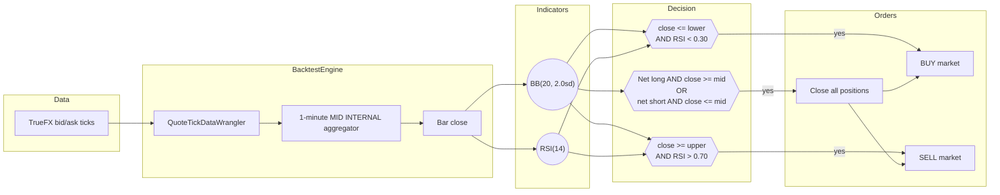

# 使用代理 FX 数据的均值回归策略（AX Exchange）

> 本文档为 [English 原文](../../docs/tutorials/fx_mean_reversion_ax.md) 的中文翻译版本。如有歧义请以英文原版为准。

本教程在 [AX Exchange](https://architect.exchange) 的 **EURUSD-PERP** 上
回测一个 Bollinger 带均值回归策略，使用
[TrueFX](https://www.truefx.com) 的 EUR/USD 现货 Tick 作为代理数据。

## 简介

策略在 1 分钟中价 K 线上结合了两个指标：

- **Bollinger Bands**（`BBMeanReversion` 的 `BB(20, 2.0sd)`）：
  滚动 20 根 K 线的均值与 ±2σ 带。带状区域用于标识价格相对于近期波动率的过度延伸。
- **相对强弱指数（Relative Strength Index）**（`RSI(14)`）：
  14 根 K 线的动量振荡器。
  NautilusTrader 中的 RSI 取值范围是 `[0, 1]`，
  因此常规的 30/70 阈值对应 `0.30` / `0.70`。

入场需要两个信号同时满足：触及下轨且 `RSI < 0.30` 开多；
触及上轨且 `RSI > 0.70` 开空。
离场是单边的：任何已开仓位在收盘价穿越 BB 中轨时平掉。
若准备开新仓且持有反向持仓，则先平掉该反向持仓。

内置的 `BBMeanReversion` 策略刻意保持简单，没有市场优势。



### 为什么使用代理数据

AX Exchange 是一家新 venue，尚未被历史数据供应商覆盖。
[TrueFX](https://www.truefx.com) 提供机构级别的 EUR/USD 现货 Tick 月度归档
（Integral 与 Jefferies 池子），可以干净地替代 AX EURUSD-PERP 回测的数据。

## 前置条件

- Python 3.12+
- 已安装 [NautilusTrader](https://pypi.org/project/nautilus_trader/)。
- 一个免费的 TrueFX 账号，用于下载每月的 Tick 归档。

## 数据准备

### 下载 TrueFX EUR/USD Tick

1. 前往 [TrueFX 历史数据下载页](https://www.truefx.com/truefx-historical-downloads/)。
2. 选择 **EUR/USD** 和一个月份，例如 **2025 年 12 月**。
3. 解压 ZIP。CSV 没有表头，列依次为
   `pair, timestamp, bid, ask`。

### 加载为 Nautilus 报价 Tick

```python
from pathlib import Path

import pandas as pd

from nautilus_trader.persistence.wranglers import QuoteTickDataWrangler

df = pd.read_csv(
    Path("EURUSD-2025-12.csv"),
    header=None,
    names=["pair", "timestamp", "bid", "ask"],
)
df["timestamp"] = pd.to_datetime(df["timestamp"], format="%Y%m%d %H:%M:%S.%f")
df = df.set_index("timestamp")[["bid", "ask"]]

wrangler = QuoteTickDataWrangler(instrument=EURUSD_PERP)  # 在下方定义
ticks = wrangler.process(df)
```

wrangler 会为每个 tick 打上 instrument ID 标签。
策略声明 `1-MINUTE-MID-INTERNAL`，因此引擎会在内部从 tick 流构建 1 分钟中价 K 线。

## Instrument 定义

代理数据需要手动定义 instrument。
乘数 `1000` 使得每张合约的名义价值为 1,000 EUR。

```python
from decimal import Decimal

from nautilus_trader.model.currencies import USD
from nautilus_trader.model.enums import AssetClass
from nautilus_trader.model.identifiers import InstrumentId
from nautilus_trader.model.identifiers import Symbol
from nautilus_trader.model.instruments import PerpetualContract
from nautilus_trader.model.objects import Price
from nautilus_trader.model.objects import Quantity

instrument_id = InstrumentId.from_str("EURUSD-PERP.AX")

EURUSD_PERP = PerpetualContract(
    instrument_id=instrument_id,
    raw_symbol=Symbol("EURUSD-PERP"),
    underlying="EUR",
    asset_class=AssetClass.FX,
    quote_currency=USD,
    settlement_currency=USD,
    is_inverse=False,
    price_precision=5,
    size_precision=0,
    price_increment=Price.from_str("0.00001"),
    size_increment=Quantity.from_int(1),
    multiplier=Quantity.from_int(1000),
    lot_size=Quantity.from_int(1),
    margin_init=Decimal("0.05"),
    margin_maint=Decimal("0.025"),
    maker_fee=Decimal("0.0002"),
    taker_fee=Decimal("0.0005"),
    ts_event=0,
    ts_init=0,
)
```

手续费与保证金是显式的回测假设。
最新费率请查阅
[AX Exchange 文档](https://docs.architect.exchange/)。

## 配置

| 参数                  | 取值   | 描述                                                       |
| --------------------- | ------ | ---------------------------------------------------------- |
| `bb_period`           | `20`   | BB 均值与标准差的滚动窗口长度。                            |
| `bb_std`              | `2.0`  | 带宽（以标准差为单位）。                                   |
| `rsi_period`          | `14`   | RSI 回看 K 线根数。                                        |
| `rsi_buy_threshold`   | `0.30` | 多头入场确认（NautilusTrader RSI 取值范围 `[0, 1]`）。     |
| `rsi_sell_threshold`  | `0.70` | 空头入场确认。                                             |
| `trade_size`          | `1`    | 每笔交易 1 张合约（名义价值 1,000 EUR）。                  |

:::tip
NautilusTrader 的 RSI 返回值在 `[0.0, 1.0]`，而不是 `[0, 100]`。
`0.30` / `0.70` 阈值对应教科书上的 30 / 70 水平。
:::

## 回测配置

```python
from nautilus_trader.backtest.config import BacktestEngineConfig
from nautilus_trader.backtest.engine import BacktestEngine
from nautilus_trader.config import LoggingConfig
from nautilus_trader.examples.strategies.bb_mean_reversion import BBMeanReversion
from nautilus_trader.examples.strategies.bb_mean_reversion import BBMeanReversionConfig
from nautilus_trader.model.data import BarType
from nautilus_trader.model.enums import AccountType
from nautilus_trader.model.enums import OmsType
from nautilus_trader.model.identifiers import TraderId
from nautilus_trader.model.identifiers import Venue
from nautilus_trader.model.objects import Money

engine = BacktestEngine(
    BacktestEngineConfig(
        trader_id=TraderId("BACKTESTER-001"),
        logging=LoggingConfig(log_level="INFO"),
    ),
)

AX = Venue("AX")
engine.add_venue(
    venue=AX,
    oms_type=OmsType.NETTING,
    account_type=AccountType.MARGIN,
    base_currency=USD,
    starting_balances=[Money(100_000, USD)],
)

engine.add_instrument(EURUSD_PERP)
engine.add_data(ticks)

strategy = BBMeanReversion(
    BBMeanReversionConfig(
        instrument_id=instrument_id,
        bar_type=BarType.from_str("EURUSD-PERP.AX-1-MINUTE-MID-INTERNAL"),
        trade_size=Decimal("1"),
        bb_period=20,
        bb_std=2.0,
        rsi_period=14,
        rsi_buy_threshold=0.30,
        rsi_sell_threshold=0.70,
    ),
)
engine.add_strategy(strategy)
engine.run()
```

报告可以直接从 `engine.trader` 获取：

```python
print(engine.trader.generate_account_report(AX))
print(engine.trader.generate_order_fills_report())
print(engine.trader.generate_positions_report())

engine.reset()
engine.dispose()
```

可运行示例位于
[`architect_ax_mean_reversion.py`](https://github.com/nautechsystems/nautilus_trader/tree/develop/examples/backtest/architect_ax_mean_reversion.py)。

## 运行结果

将 2025 年 12 月的 TrueFX EUR/USD 数据通过 `BBMeanReversion(20, 2sd, RSI 14)` 重放，
共打印 44,591 根 1 分钟中价 K 线，关闭了 1,089 个仓位、共 2,178 次成交。
累计已实现盈亏（PnL）为 **-1,287 USD**：策略整月稳步亏损，
未出现明显由市场状态驱动的反转。
无市场状态过滤的均值回归会在每个周期支付价差，
而 12 月下半月 EUR/USD 经历了显著的上行趋势，策略反复与之对抗。


**图 1.** *2025 年 12 月 EUR/USD 的 1 分钟中价 K 线，含 BB 中轨与 ±2σ 带。
长段水平的空白是 TrueFX 数据源中的周末缺口。*


**图 2.** *数据集中段附近 12 小时缩放视图。
上图：中价及 BB 带、多头入场（向上三角）、空头入场（向下三角）以及离场成交（×）。
下图：RSI(14) 与 0.30 买入 / 0.70 卖出阈值。*


**图 3.** *整月每根 K 线上 BB z-score 对 RSI 的散点。
阴影区域为可入场象限：左下（多头）与右上（空头）。
对角的椭圆形分布是带相对价格与 RSI 之间天然的共动现象。*


**图 4.** *已平仓位累计已实现 USD 盈亏。
曲线大致呈线性下降，被价差与每个周期的小幅不利波动所主导。*

### 重新生成面板

下面是一个自包含的渲染脚本，它会重新运行回测，
在所捕获的 K 线上重新计算 BB 与 RSI，
并使用共享的 `nautilus_dark` tearsheet 主题输出 PNG 面板。

```bash
uv sync --extra visualization
TRUEFX_CSV=tests/test_data/local/truefx/EURUSD-2025-12.csv \
    python3 docs/tutorials/assets/fx_mean_reversion_ax/render_panels.py
```

将 `TRUEFX_CSV` 设置为你保存 EUR/USD 归档的位置。

## 下一步

- **加入市场状态过滤器**。亏损集中在趋势性会话中。
  当已实现波动幅度或较慢的趋势过滤器判定市场处于方向性运行时，抑制入场。
- **调整阈值**。更宽的带（`bb_std=2.5`）或更严的 RSI 阈值
  （`0.25` / `0.75`）会减少入场，但提升确认门槛。
- **加入止损**。硬性止损订单可以限制每个周期的下行风险，
  并避免把亏损头寸一路扛到 BB 中轨反转。
- **接入 AX 沙盒进行实盘**。回测达到预期后，可以连接 AX 沙盒进行模拟交易。
  设置方法请参见
  [AX Exchange 集成指南](../integrations/architect_ax.md)。

## 运行实盘

同一个 `BBMeanReversion` 策略可以在 AX Exchange 上实盘运行。
启动脚本只需把 `BacktestEngine` 换成配置好 AX 数据与执行客户端的 `TradingNode`。
实盘示例参见：
[`ax_mean_reversion.py`](https://github.com/nautechsystems/nautilus_trader/tree/develop/examples/live/architect_ax/ax_mean_reversion.py)。

关于连接设置与 API key 配置，参见
[AX Exchange 集成指南](../integrations/architect_ax.md)。

## 延伸阅读

- [`BBMeanReversion` 策略源码](https://github.com/nautechsystems/nautilus_trader/tree/develop/nautilus_trader/examples/strategies/bb_mean_reversion.py)
- [黄金永续合约的订单簿失衡策略教程](gold_book_imbalance_ax.md)
- [Architect Exchange 文档](https://docs.architect.exchange/)
